본 문서는 2020년 7월 21일 ~ 24일 부산 클라우드 혁신 센터에서 진행된 AWS 전문교육 '클라우드 아키텍처 양성과정(Archtecting on AWS)'의 내용과, AWS Documentation을 토대로 작성되었습니다.

## AWS 소개

기존 On-premise 환경과 달리, AWS와 같은 클라우드가 가지는 이점이 무엇 일까요?

> **On-premise**  
> 기업의 서버를 클라우드와 같은 원격 환경이 아닌 자체 보유한 전산실 서버에서 직접 운영하는 방식.

클라우드는 기존 온프레미스 환경에 반하여 유연성과 민첩성을 제공한다는 점이 큰 장점입니다. 사용자는 클라우드 제공자에 의해 제공되는 미리 준비된 컴퓨팅 자원 및 컴퓨팅 서비스, 네트워킹 서비스 등을 쉽게 이용하고, 이용에 대한 비용을 지불합니다. 또한, 추상화된 많은 컴퓨팅 자원을 마치 소프트웨어와 같이 사용하고 운용할 수 있게 됩니다.

- **자본 비용을 가변 비용으로 대체.**

    데이터 센터, 물리적 서버 등을 구입하고, 관리하는 비용이 AWS에 의해 미리 구축되어 있는 서버, 데이터 센터를 사용하고 그 사용량에 비례한 비용으로 대체됩니다.
    **["규모의 경제"](https://ko.wikipedia.org/wiki/%EA%B7%9C%EB%AA%A8%EC%9D%98_%EA%B2%BD%EC%A0%9C)** 현상으로 인해 AWS를 비롯한 클라우드 서비스는 규모가 커질 수록, 비용이 낮아집니다. 이에 따라, 현재 AWS의 비용 역시 지속적으로 낮아지고 있습니다. 이는 자체적으로 인프라를 구축하는 것보다 더욱 저렴한 인프라 구축이 가능함을 의미합니다.

- **용량 추정이 불필요.**

    가용한 용량을 예측하여 인프라를 구축해야 했던 기존과 달리 클라우드에서는 용량을 가변적으로 줄이고, 늘릴 수 있습니다. 예를 들어, 추석과 설날에 많은 트래픽을 감당해야 하는 커머스 애플리케이션은 일년 중 10일이 채 되지 않는 특별한 날을 위해 남은 355일의 평범한 날은 컴퓨팅 자원을 낭비 해야할 수 밖에 없었습니다.
    이런 상황을 "오버 프로비저닝" 되었다고 말하곤 합니다. 클라우드에서는 비즈니스의 요구에 따라 용량 등 컴퓨팅 리소스를 즉시 늘리거나 줄일 수 있습니다. 물론, 이를 자동화 시키는 것도 가능합니다.

- **속도와 민첩성의 향상.**

    클라우드 서비스로부터 제공되는 광범위한 기술에 API, CLI, GUI로 쉽게 액세스할 수 있어, 더 빠르고 민첩하게 서비스를 구축 및 변경할 수 있습니다.

- **더욱 중요한 것에 집중.**

    서비스 배포를 위해 사전에 필요한 작업들을 AWS에 준비된 많은 서비스를 사용하는 것으로 대체하여 인프라 준비와 관리에 필요한 인적, 물적, 시간적 자원을 최소화해, 더욱 중요한 것에 집중할 수 있도록 만듭니다.

- **쉽게 글로벌 서비스를.**

    세계적으로 마련된 AWS의 인프라 센터는 사용자로 하여금 마우스 클릭 몇 번으로 전 세계적 서비스 배포를 가능하게 합니다. 가용한 AWS 인프라 센터는 지속적으로 늘어나고 있습니다.

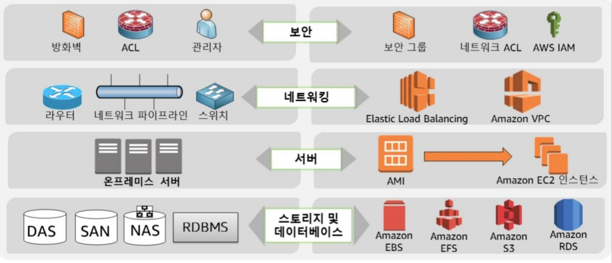

[온프레미스와 AWS환경의 대조]

## AWS의 글로벌 인프라

앞서 언급했 듯, AWS는 전 세계 주요 지역에 인프라를 구축하고 있습니다. 이와 관련된 세 가지 개념을 알아봅시다.

- **리전 (Region)**

    AWS의 **논리적 인프라 환경**을 **"지리적 대표 도시명"**으로 표현한 것을 말합니다. 눈여겨 보아야 할 것은 "논리적" 단위라는 것입니다. 실제 인프라는 그 도시에 위치하지 않을 수 있습니다. 리전은 최소 2개 이상의 가용 영역을 포함하고 있습니다.

- **가용 영역 (Availability Zone, AZ)**

    하나 이상의 **데이터 센터의 클러스터**로, 여러 개의 가용 영역이 하나의 리전에 포함됩니다. (2020.07.28 현재 서울 리전은 4개의 가용 영역을 포함하고 있습니다.)
    각 가용 영역은 **결함 분리, 재해 복구 및 대비(Disaster Recovery)를 위해 물리적으로 분리된 시설에 구축**되어 있습니다. 사용자가 선택하여 동일한 서버를 여러 가용 영역에 분산하여 배치하여 더욱 안전하게 서비스할 수 있습니다. 또한, 각 가용 영역 사이의 통신은 내부적 백본을 통하여 신속함을 보장합니다.

- **엣지 로케이션 (Points of Presence, PoP)**

    **Route53**(AWS의 DNS), **CloudFront**(AWS의 CDN), **WAF**(Web Application Firewall), **Shield**(DDoS protecting)와 같은 글로벌 서비스를 지원하는 **로컬 물리적 지점**입니다. 사용자와 가까운 지점을 위치시키기 위한 글로벌 인프라 입니다. 이는 가용 영역과 달리 리전과는 별도로, 200개 이상의 엣지 로케이션이 전 세계적으로 퍼져 있습니다.

## AWS의 기초 서비스

### EC2 (Elastic Compute Cloud)

EC2는 On-premise 환경에서의 "서버" 와 같이 CPU, Memory, OS등을 가지는 컴퓨터입니다. 하지만 실제 서버 컴퓨터와는 다르게 가상의 컴퓨팅 환경으로, 쉽게 컴퓨팅 파워를 조정할 수 있습니다. AWS 글로벌 인프라 안에서 여러 가용 영역에 걸쳐 배포하여 안정성과 고 가용성을 만족할 수 있습니다. 아래는 EC2와 관련한 개념들에 대한 설명입니다.

> **고 가용성(High availability)**  
> 서버, 네트워크, 프로그램 등의 시스템이 상당히 오랜 기간 동안 지속적으로 정상 운영이 가능한 성질.

- **AMI(Amazon Maching Image)**

    AMI는 OS등 **소프트웨어 구성이 기재된 템플릿**입니다. EC2를 시작하는 데에 필요한 정보를 담고 있습니다. 하나의 AMI에서 여러 인스턴스를 만들어 낼 수 있습니다. 사전 구축된 AMI를 사용하거나, market place에서 배포되고 있는 AMI를 구입 하거나 사용할 수 있습니다. 더불어 사용자가 자체적으로 AMI를 생성하고 사용할 수 있습니다. AMI는 Docker의 이미지를 떠올리면 이해가 쉽습니다.

- **인스턴스(Instance)**

    인스턴스는 **가상 컴퓨팅 환경**을 말합니다. 인스턴스는 선택한 AMI의 구성을 따릅니다. 인스턴스는 유형에 따라 컴퓨팅 하드웨어가 결정됩니다. 각 인스턴스 유형은 서로 다른 CPU와 메모리를 제공합니다.  
    또한 인스턴스는 유형에 따라 자체 스토리지를 가질 수 있습니다. 인스턴스 자체의 스토리지를 **"인스턴스 스토어"**라고 합니다. 인스턴스 스토어는 임시 스토리지로, 영구성을 보장하지 않습니다.  
    유형에 따라 따로 존재하는 영구 저장 공간을 연결할 수 있습니다. 여기에는 대개 EBS(Elastic Block Service)볼륨이 사용됩니다. EBS에 대해서는 후에 설명합니다.

- **인스턴스 유형**

    범용, 컴퓨팅 최적화, 메모리 최적화, 가속화된 컴퓨팅, 스토리지 최적화 등 각 사용 사례에 맞게 최적화된 다양한 인스턴스 유형이 있습니다. 사용자는 이 유형 중 하나를 선택해 EC2 인스턴스로 만들 수 있습니다.
    인스턴스 유형은 패밀리와 세대번호, 인스턴스 크기로 세부 구분됩니다. 패밀리는 해당 유형의 특징에 대한 정보를 담고 인스턴스 크기는 CPU와 Memory의 크기에 대한 정보를 담고 있습니다.

  - `t` 패밀리: 웹사이트 및 웹애플리케이션 같은 일시적으로 폭증할 수 있는 워크로드에 적합. 보통 상황에 쓰지 않는 용량을 credit 으로 모아 두었다가 트래픽이 폭증 했을 때 사용합니다.
  - `c` 패밀리: 컴퓨팅 집약적 워크로드에 적합합니다.
  - `r` 패밀리: 메모리 집약적 애플리케이션 또는 CPU보다 RAM이 더 필요한 경우에 사용합니다.
  - `h` 패밀리: 인스턴스 스토리지를 제공하는 패밀리. (인스턴스 스토리지는 휘발성 임을 꼭 상기하여야 합니다.)

- **EC2의 요금 옵션**
  - **온 디멘드** - 시간/초 단위 결제
  - **예약 인스턴스** - 온 디멘드 대비 70% 이상 싸지만, **기간 약정**을 통해 구매하므로 해당 약정 기간 만큼 무조건 사용하여야 합니다.
  - **예정된 인스턴스** - 특정 기간/특정 시간에만 반복 사용 가능한 인스턴스를 구매하는 방식입니다. (예로, 은행업무의 경우 4시~6시는 정산 트래픽이 발생하므로 해당 시간에만 사용하는 등의 경우)
  - **스팟 인스턴스** - 현재 AWS 클라우드 상에, 사용 가능한 인스턴스가 있고 입찰 가격이 스팟 가격을 초과하는 한 계속 실행할 수 있는 미 사용 인스턴스를 입찰하는 방식입니다.  
    회수될 가능성이 있어, 작업 종료에 2분 이상 걸리는 작업은 불안정할 수 있습니다. 현재는 스팟 가격의 상한을 설정할 수 있어 조금의 안정성은 생겼습니다.
  - **전용 호스트(전용 옵션)** - 전용 물리적인 호스트를 구입하여 비용을 지불하는 방식입니다. ( 대개, 라이센스가 있는 상용 소프트웨어를 사용하는 경우와 같이 장비에 대한 가시성이 필요한 경우 사용합니다. )
  - **전용 인스턴스(전용 옵션)** - 인스턴스 구매 시 하드웨어 장비를 독점하여 사용하도록 계약하는 방식입니다. 하지만 유의할 점은 인스턴스가 Stop, Start하게 되면 하드웨어 장비는 변경됩니다. 워크로드의 격리가 필요한 경우 이를 선택할 수 있습니다.

- **사용자 데이터**

    인스턴스가 시작된 이후 실행되는 스크립트를 정의할 수 있습니다. 해당 스크립트를 "사용자 데이터"라고 부릅니다. 사용자 데이터는 인스턴스 시작 시 첫 1회만 해당 스크립트 작업을 실행합니다.  
    한 가지 알아야 할 것은, 해당 스크립트가 실행된 환경을 AMI로 만들어 해당 AMI를 기반으로 인스턴스를 실행할 수도 있습니다. 대개 사용자 데이터는 이미지로 만들기는 과분한 경우 사용됩니다.

### EBS (Elastic Block Storage)

일관되고 지연 시간이 짧은 성능을 제공하는 영구적인 **블록 스토리지 볼륨**입니다. 접근을 위해 컴퓨팅 파워가 필요한 실제 HDD와 SDD와 같이, EBS는 홀로 사용될 수는 없고 EC2 인스턴스에 연결하여 사용할 수 있습니다. EBS와 함께 사용될 수 있는 AMI로 시작한 인스턴스에 연결할 수 있습니다.  
EBS는 **특정 가용 영역에서 생성한 후 동일한 가용 영역에 있는 아무 인스턴스에나 연결할 수 있습니다**. 가용 영역 외부에 볼륨을 제공하고자 할 때에는, 스냅샷을 생성하여 해당 리전내에서 새 볼륨으로 복원할 수 있습니다. 생성된 스냅샷은 S3에서 내부적으로 AWS에 의해 관리됩니다.

- **EBS 볼륨의 유형**
  - **범용 SSD**

      1GiB당 3 IOPS를 기본 성능으로 제공하며, 다양한 트랜잭션 로드에 적합합니다.

  - **프로비저닝된 IOPS SSD**

      IOPS를 기준으로하는 볼륨으로, 최대 64,000IOPS 및 1,000MiB/s의 처리량을 지원합니다. 일정 수준의 IOPS가 항상 보장되어야 하는 상황에 적합합니다.

  - **처리량 최적화 HDD**

      IOPS가 아닌 처리량으로 성능을 정의하는 저비용 마그네틱 스토리지로, 자주 액세스하고 처리량 집약적인 워크로드에 적합합니다. (ETL, Data Warehouse, Log store)

  - **Cold HDD**

      IOPS가 아닌 처리량으로 성능을 정의하는 저비용 마그네틱 스토리지로, 자주 액세스 할 필요가 없고 비용을 절약해야 하는 장기 보존을 위한 상황에 적합합니다. (이후에 알아 볼 S3 Glacier와 비슷합니다.)

    > **IOPS(Input/Output Operations per Second)**  
    > 저장 장치의 속도를 나타내는 측정 단위입니다.

- **용량**

    EBS는 용량을 쉽게 변경할 수 있습니다. 제공된 EBS 볼륨 유형과 제공된 스토리지 GB에 근거하여 과금 됩니다.

- **"볼륨"의 의미**

    EBS는 인스턴스에 "마운트(연결)"하여 사용할 수 있는 스토리지 볼륨입니다. 이는 인스턴스의 시작, 중단, 종료와는 관계없이 독립적으로 존재하여, 인스턴스와는 별개로 EBS 블록은 지속적으로 유지됩니다. 휘발성을 가지고 있던 EC2 인스턴스의 자체적 스토리지인 인스턴스 스토어와는 다르다는 것을 알 수 있습니다.  
    단순하게 생각하면 EBS는 일상에서 사용하는 USB와 같다고 볼 수 있습니다. 한 데스크탑에 여러 USB 포트가 있듯, 하나의 EC2 인스턴스에 여러 개의 EBS볼륨을 연결할 수 있습니다. 하나의 USB가 여러 데스크탑에 연결될 수 없듯, 하나의 EBS 볼륨은 여러 EC2인스턴스에 연결될 수 없습니다.

### S3 (Simple Storage Service)

인터넷용 Object 스토리지로, 기본적으로 HTTP와 HTTPS 프로토콜의 인터넷을 통한 액세스 방식을 가집니다. 웹에서 언제 어디서나 원하는 양의 데이터를 저장하고 검색할 수 있습니다. 고도의 확장성과 안정성, 속도 및 내구성을 가지고 있습니다. S3에 저장할 수 있는 객체 수에 제한이 없고, 저장할 수 있는 객체의 크기는 최대 5TB 입니다.

- **버킷(Bucket)**

    버킷은 S3에 저장된 객체에 대한 컨테이너입니다. 파일 시스템으로 이해를 해 본다면 폴더와 같다고 볼 수 있습니다. 사실 이는 실제로는 명확히 다릅니다. S3는 각 객체를 구조적으로 저장하지 않습니다. 각 리전에서 버킷을 여러 개 생성할 수 있습니다.  
    버킷의 이름은 리전에 상관없이 전역적으로 고유해야합니다. 또한 `_`, 대문자, IP주소 등을 사용하지 못합니다.

- **객체(Object)**

    객체(Object)는 S3에 저장되는 기본 엔티티입니다. 객체는 데이터와 메타 데이터로 구성됩니다. "데이터"는 AWS S3 console에서는 볼 수 없고, 권한을 갖춘 사용자가 HTTP/HTTPS 를 통한 접근 시 볼 수 있습니다. "메타 데이터"는 객체를 설명하는 key-value의 집합입니다. 수정한 날짜, Content-Type과 같은 HTTP 메타 정보 등을 포함합니다.

- **객체의 식별**

    모든 객체는 "키(key)" 라는 고유 식별자를 가지고 있습니다. 버킷과 키 및 버전의 조합으로 각 객체를 고유하게 식별할 수 있습니다. 이름이 "examples"인 버킷에 있는 userimg/2020-07-28/test.png 라는 키를 가진 객체에 접근한다면, `https://examples.s3.amazonaws.com/userimg/2020-07-28/test.png` 와 같은 URL로 요청 하여야 합니다.

- **객체 버전 관리**

    S3는 객체가 중복될 시 덮어씁니다. 이는 실수에 의한 데이터 손실을 유발할 수 있습니다. 버전 관리는 성능 저하 없이 실수로 덮어쓰거나 삭제하는 것을 방지할 수 있게 돕는 기능으로, 모든 업로드에 대해 새 버전을 생성합니다. 빠르게 이전 버전으로 롤백이 가능합니다. 요금은 버전과 같이 쌓입니다.

- **객체 관리 스토리지 클래스**

    각 객체에는 연결된 스토리지 클래스가 있습니다.

  - **Standard**: 기본 스토리지 클래스로, 자주 액세스되는 데이터에 적합합니다.
  - **Standard IA(Infrequent Access)**: 수명이 길고 자주 액세스되지 않는 데이터에 적합합니다.
  - **One zone IA**: 수명이 길고 자주 액세스하지 않으며 중요하지 않은 데이터에 적합합니다. 단일 가용영역에만 저장됩니다.
  - **Glacier**: 저렴한 장기 아카이빙이 필요한 데이터에 적합합니다. 표준 검색 시간이 분-시간 단위 입니다. EBS의 Cold HDD 유형과 비슷한 역할을 합니다.
  - **S3 Intelligent-Tiering**: 자주 액세스하거나 자주 액세스 하지 않는 객체를 가장 비용 효율적인 스토리지 클래스로 자동으로 이동하여 스토리지 비용을 최적화 합니다. (AWS의 기계 학습 모델을 통해.)

- **객체의 수명 주기 관리**

    수명 주기 구성을 설정하여 **특정 객체 그룹에 적용되는 "전환" 또는 "만료" 작업을 정의할 수 있습니다**. 여기서 전환은 스토리지 클래스의 전환을 의미합니다. 예를 들어 다음과 같이 객체의 수명 주기를 설정할 수 있습니다.  
    standard 업로드 → 30일 이후 → standard IA → 60일 → s3 Glacier → 365일 → 삭제(만료)

- **S3의 보안**

    기본적으로 버킷, 객체 및 관련 하위 리소스(lifecycle 등 구성 정보)는 모두 비공개(private)입니다. 즉, 리소스를 만든 계정 소유자만 액세스할 수 있습니다. S3는 **리소스 기반 정책**과 **사용자 정책**으로 접근에 대해 정의합니다.
    버킷 및 객체에 연결하는 액세스 정책을 리소스 기반 정책이라고 합니다. 버킷 정책 또는 ACL(Access Control List)은 리소스 기반 정책입니다. 계정의 IAM(Identity and Access management)사용자에게 S3 접근 권한을 가진 정책을 연결할 수도 있습니다. 이를 사용자 정책이라고 합니다. 이러한 두 정책을 조합하여 사용하여 S3의 리소스를 보안적으로 관리할 수 있습니다.

    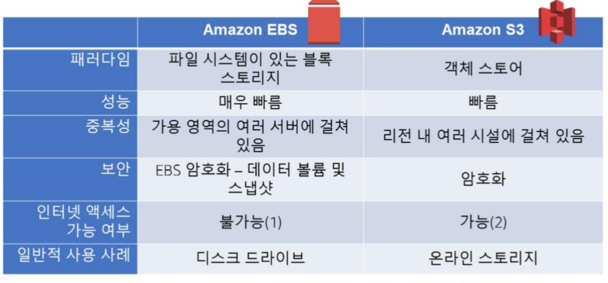
    
[EBS 와 S3의 비교]

## AWS의 네트워크 서비스

### VPC (Virtual Private Cloud)

AWS 클라우드에서 다른 가상 네트워크와 논리적으로 격리되어 있는 **AWS계정 전용 가상 네트워크**입니다. 필요 시, 개발, 프로덕션, 테스트 등과 같이 각각의 워크 로드를 다른 VPC 상에 배치하여 논리적으로 격리할 수 있습니다.

- **VPC의 특징**
  - VPC는 **하나의 리전에 포함**되며, 리전 안에 있는 모든 가용 영역의 리소스를 호스팅 할 수 있습니다.
  - **각 VPC는 완전히 독립**입니다. 기본적으로는 VPC간의 통신은 제한됩니다. 필요 시, VPC Peering 서비스를 사용해 두 VPC 사이의 네트워크를 연결하여 서로 통신할 수 있습니다. 더 많은 VPC간의 통신이 가능한 환경을 원한다면, Transit Gateway 서비스를 이용할 수 있습니다. VPC 피어링과 Transit Gateway에 대한 내용은 후에 다시 설명합니다.
  - VPC는 사용자가 지정하는 private IP 주소의 범위를 예약합니다. IP 주소는 **[CIDR(Classless Inter-Domain Routing)표기법](https://ko.wikipedia.org/wiki/%EC%82%AC%EC%9D%B4%EB%8D%94_(%EB%84%A4%ED%8A%B8%EC%9B%8C%ED%82%B9))**을 사용하여 정의됩니다.  
  예를 들어, `10.0.0.0/16` = `10.0.0.0` 에서 `10.0.255.255` 까지의 모든 IP를 의미합니다.

    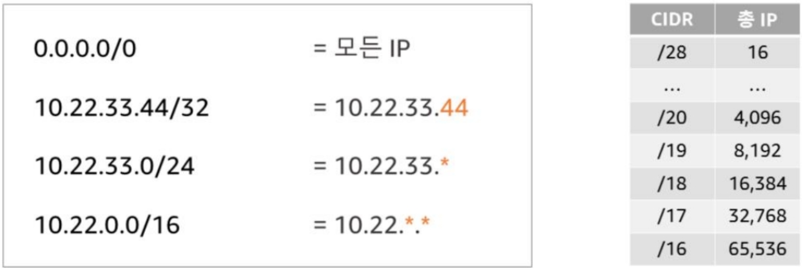
    
[CIDR 경로에 따르는 총 IP 개수]

- **서브넷(Subnet)**

    서브넷은 리소스 그룹을 격리할 수 있는 **VPC의 IP 주소 범위의 세그먼트 또는 파티션**입니다. 즉, 서브넷은 VPC의 부분으로, VPC CIDR 블록의 하위 집합이고, 서브넷 간 CIDR블록이 중첩될 수는 없습니다. VPC 의 부분이므로 당연히 IP 범위가 소속된 VPC보다 작습니다.

    **각 서브넷은 하나의 가용 영역 내에서만 존재**하며, **하나의 가용 영역에 여러 개의 서브넷이 포함**될 수 있습니다. 한 가지 유의해야 할 점은, 서브넷은 언제나 5개의 IP 주소를 기본적으로 예약합니다. 따라서 의미 없이 서브넷을 나누게 되면 낭비되는 IP 주소가 생길 수 있습니다.

    서브넷은 인터넷과 통신할 수 있는 지의 여부로 Public/Private Subnet으로 나뉩니다.

  - **퍼블릭 서브넷(Public Subnet)**

      인터넷에 대한 Inbound/Outbound 액세스를 지원하도록 **"인터넷 게이트웨이"**에 대한 라우팅 테이블 항목을 포함하고 있는 서브넷을 **퍼블릭 서브넷**이라고 합니다.

  - **프라이빗 서브넷(Private Subnet)**

      **"인터넷 게이트웨이"에 대한 라우팅 테이블 항목이 없고**, 퍼블릭 **인터넷에서 직접 액세스할 수 없는 서브넷을 프라이빗 서브넷**이라고 합니다. 일반적으로 인터넷과의 통신이 필요한 경우에, 제한된 outbound 퍼블릭 인터넷 액세스를 지원하기 위해 "NAT(Network Address Translation) 게이트웨이"를 사용합니다.

    인터넷의 트래픽을 받아들일 수 있는 서브넷은 퍼블릭 서브넷, 인터넷에서 직접 액세스 할 수 없는 서브넷을 프라이빗 서브넷이라고 합니다. 이에 대한 내용은 아래 인터넷 게이트웨이와 라우팅 테이블 그리고 NAT를 설명하며 더욱 보충하겠습니다.

    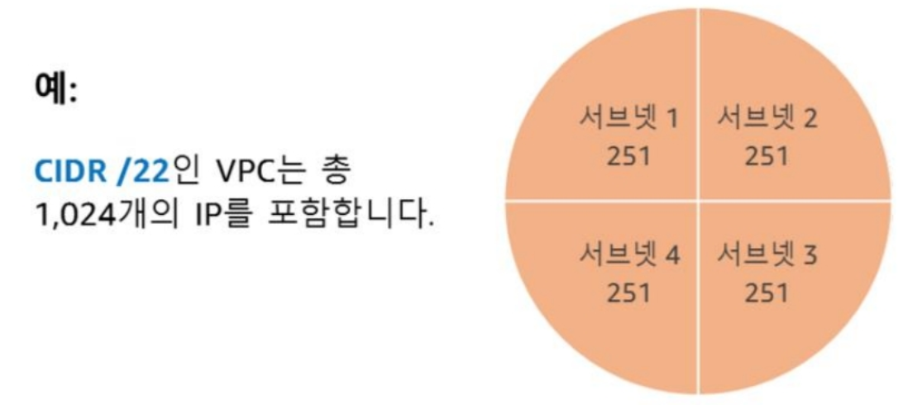
    
[CIDR /22인 VPC의 4개의 서브넷 IP의 총 합은 1004개]

- **라우팅 테이블(Routing Table)**

    라우팅 테이블은 서브넷 또는 게이트웨이의 **네트워크 트래픽이 전송되는 위치를 결정하는 데 사용되는 규칙(이 규칙을 "Routing" 이라고 합니다)의 집합**입니다.

    각 VPC에는 "local"로 향하는 기본 라우팅 테이블이 존재합니다. 이 기본 라우팅 테이블은 다른 라우팅 테이블과 명시적으로 연결되지 않은 모든 서브넷의 라우팅을 제어합니다. 즉, 서브넷의 트래픽 라우팅을 조절하고 싶은 경우, 그에 대한 라우팅 테이블을 만들어 연결하면 해당 서브넷은 지정한 라우팅 테이블의 규칙에 따라 트래픽을 처리하게 됩니다.  

    `0.0.0.0/0` 모든 IP로 향햐는 라우팅이 포함된 라우팅 테이블을 **퍼블릭 라우팅 테이블**이라고 하고, 그렇지 않은 경우는 **프라이빗 라우팅 테이블**이라고 합니다.  

  - **라우팅(Routing)**

        라우팅 테이블의 각 규칙 라우팅은 목적지 및 대상을 지정합니다.  예를 들어, 특정 서브넷을 곧 알아 볼 "인터넷 게이트웨이"를 통해 인터넷에 엑세스할 수 있도록 하려면 해당 서브넷의 라우팅 테이블에 다음 라우팅을 추가할 수 있습니다.

        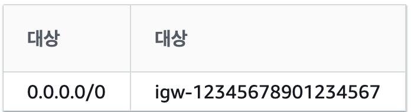
        
[인터넷 트래픽을 "인터넷 게이트웨이"로 라우팅하는 라우팅 테이블]

- **인터넷 게이트웨이(Internet Gateway)**

    **VPC 내에 있는 인스턴스와 인터넷 간에 통신을 허용할 수 있게 해주는 도구**로, 수평 확장되고 가용성이 높습니다.  
    인터넷 게이트웨이는 인터넷으로 라우팅 가능한 트래픽에 대한 라우팅 테이블에 대상을 제공합니다. (위의 표에서와 같습니다.)  
    또한 인터넷 게이트웨이는 퍼블릭 IPv4 주소가 할당된 인스턴스에 대해 NAT(네트워크 주소 변환)를 수행합니다.

    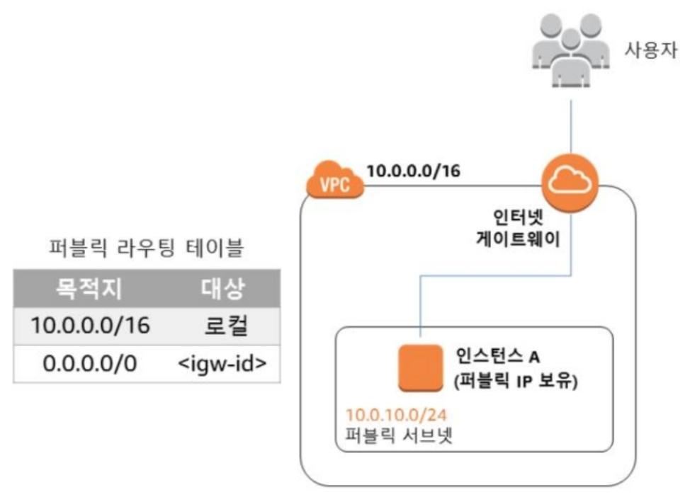
    
[인터넷 게이트웨이와의 연결을 갖는 퍼블릭 서브넷]

- **NAT 게이트웨이 (Network Address Translation Gateway)**

    **프라이빗 서브넷의 인스턴스가 인터넷 또는 다른 AWS 서비스로의 아웃바운드 트래픽을 활성화**할 수 있게  하는 한편,  **인터넷에서의 인바운드 트래픽은 차단**하는 서비스입니다.
    NAT 게이트웨이는 임의로 인터넷 연결을 할 수 있는 퍼블릭 인터넷 IP를 한시적으로 부여하여 아웃바운드 트래픽이 가능하게 합니다. 따라서 NAT 게이트웨이는 항상 퍼블릭 서브넷 상에 위치하여야 합니다. 또한 연결된 탄력적 IP 주소가 존재하여야 하며, 프라이빗 서브넷과 연결된 라우팅 테이블을 업데이트하여 인터넷으로부터의 트래픽이 NAT 게이트웨이로 전달되도록 해야 합니다.

    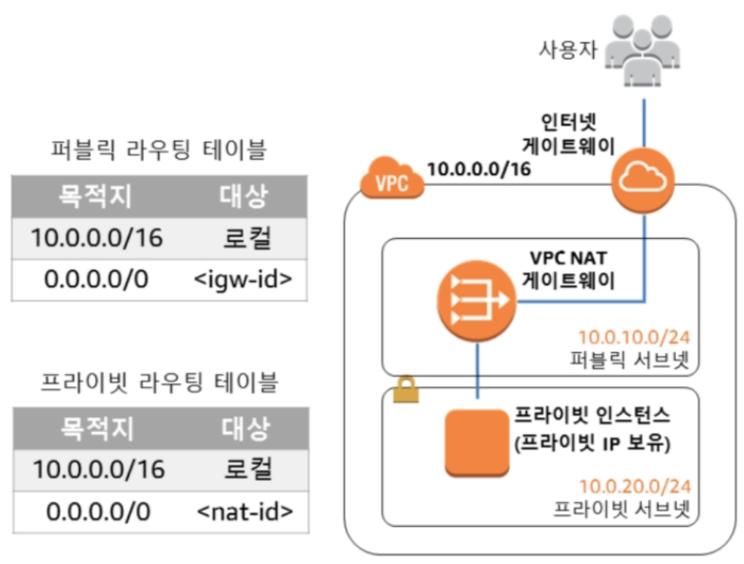
    
[NAT 게이트웨이를 통해 인터넷과 통신하는 프라이빗 인스턴스]

- **탄력적 네트워크 인터페이스 (Elastic Network Interface, ENI)**

    VPC에서 가상 네트워크를 나타내는 인터페이스로, 동일한 가용 영역 상의 EC2 인스턴스에 연결할 수 있습니다. MAC 주소, 프라이빗 IPv4 주소, 퍼블릭 IPv4, IPv6 주소, 보안그룹 등의 정보를 담고 있습니다.

- **탄력적 IP 주소 - 인스턴스와 무관한 고정 IP(Elastic IP, EIP)**

    EIP는 동적 클라우드 컴퓨팅을 위해 고안된 고정 IPv4 주소로, 인스턴스의 라이프사이클에 따라 바뀌는 IP를 고정하여 사용할 수 있도록 합니다. 인스턴스에 직접 연결하거나 네트워크 인터페이스에 연결할 수 있습니다.  
    EIP는 한 번에 하나의 인스턴스에만 할당 가능하고 VPC에 5개로 제한됩니다.

- **보안그룹 (Security Group, SG)**

    보안 그룹은 **AWS 리소스에 대한 인바운드 및 아운바운드 트래픽을 제어하는 가상 방화벽**입니다. 보안 그룹은 서브넷 수준이 아니라 **인스턴스 수준에서 작동**하여 VPC에 있는 서브넷의 각 인스턴스를 서로 다른 보안그룹을 할당할 수 있습니다.

    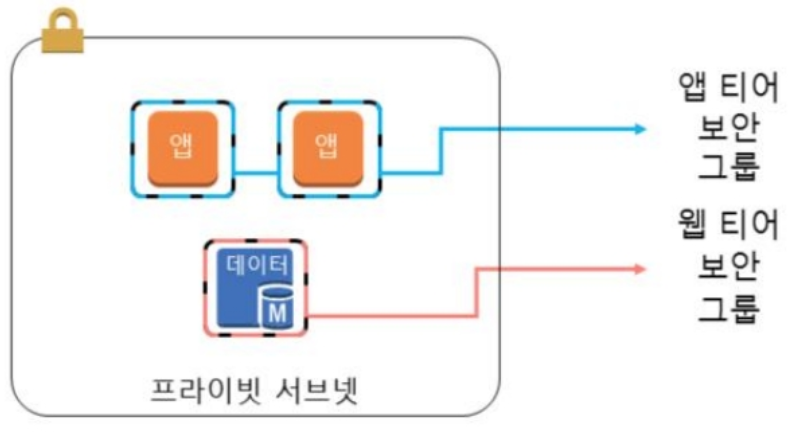
    
[인스턴스 수준에서 작동하는 보안 그룹]

  - 새 보안 그룹을 생성하면 기본적으로 모든 인바운드 트래픽을 차단, 모든 아웃바운드 트래픽을 허용하도록 설정되어 있습니다. 따라서 필요한 인바운드 트래픽을 허락해 주어야 합니다. 또한, 트래픽 허용 규칙을 지정할 수 있지만 **트래픽 거부 규칙은 지정할 수 없습니다**.
  - 보안 그룹(A)은 다른 보안 그룹(B)을 참조하여 다른 보안 그룹(B)의 트래픽을 (A)에서 허용하는 것과 같이 **체인화가 가능**합니다. 이렇게 되면, 적용되는 리소스가 변화되더라도 보안 그룹이 자동적으로 설정되어 관리가 원활해 집니다.

    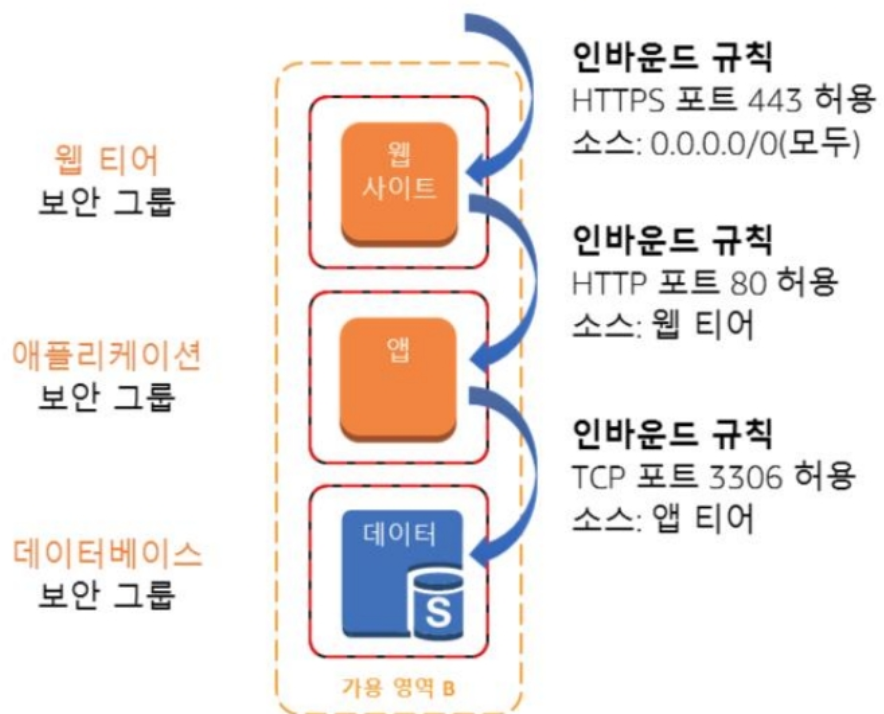
    
[보안그룹 체이닝]

- **네트워크 액세스 제어 목록 (Network Access Control List, NACL)**

    **서브넷 단위의 가상의 방화벽**으로, 기본적으로 모든 인바운드 및 아운바운드 트래픽을 허용합니다. 보안 그룹과는 달리 **"상태 비 저장"**방식으로, 모든 인바운드 및 아웃바운드 트래픽에 대한 명시적인 규칙이 필요합니다.  
    VPC에 연결하여 네트워크 액세스를 제어할 수 있습니다. 대체로 보안 그룹보다 ACL의 관리는 어렵습니다. 사내 "네트워크 관리자"가 있지 않다면 SecurityGroup으로 트래픽을 관리하는 것을 권장합니다. 추가적으로, ACL과 보안 그룹이 충돌되는 경우 보안 그룹이 더 높은 우선순위를 가집니다.

- **VPC간 통신**

    일반적으로, VPC는 완전 격리하는 것이 권장됩니다. 그러나 부득이하게 둘 이상의 VPC 간의 데이터를 인터넷을 거치지 않고 비공개적으로 통신해야하는 경우도 있을 수 있습니다.

  - **VPC Peering**

        VPC 피어링은 비공개적으로 두 VPC 간에 트래픽을 라우팅할 수 있도록 하는 VPC 사이의 네트워킹 연결입니다. 피어링 이후 연결된 두 VPC는 동일한 네트워크에 속한 것과 같이 VPC 내부의 인스턴스가 서로 통신할 수 있습니다. 서로 다른 AWS 계정 간의 VPC 피어링도 가능합니다.  
        피어링은 요청, 승인에 의해 진행되고, 각 VPC 에서 라우팅 테이블 피어링 대상으로의 수정이 필요합니다. 당연하게도 피어링되는 두 VPC 간 중복되는 IP 주소가 없어야 합니다.

  - **Transit Gateway**

        단이 게이트웨이로 최대 5000개 까지의 VPC와 온프레미스 네트워크 환경을 연결할 수 있으며 네트워크 사이를 이동하는 모든 트래픽의 허브 역할을 하는 서비스입니다. 클라우드-온프레미스 하이브리드 환경을 조성 시 더욱 효율적 환경을 제공합니다.

  - **VPC Endpoint**

        인터넷 게이트웨이, NAT, VPN연결 등을 사용하지 않고 **VPC외부의 AWS서비스와 비공개로 연결할 수 있도록 지원하는 기능**입니다. 동일한 리전 내에 있는 서비스에 대해 가능하고 이를 사용하면 인터넷을 통해 통과할 필요가 없습니다. VPC와 서비스 간의 트래픽은 Amazon 네트워크 내에서 이뤄집니다.  
        예를 들어, S3는 HTTP, HTTPS 프로토콜을 지원하는 데, VPC 엔드포인트 기능을 이용하면 인터넷 요청 없이 곧바로 내부적으로 접근할 수 있습니다.

- **VPC 서브넷의 사용 사례**

    인터넷을 통해 접근이 필요한 경우에만 퍼블릭, 이외의 경우는 모두 프라이빗으로 설정하는 게 좋습니다. 예를 들면 다음과 같습니다.

  - 데이터 스토어 - **프라이빗**
  - 배치 처리 인스턴스 - **프라이빗**
  - 백엔드 인스턴스 - **프라이빗**
  - 웹 애플리케이션 인스턴스 - 퍼블릭일수 있으나, 프라이빗으로 설정한 이후, **로드밸런서를 퍼블릭에** 두고, **프라이빗 서브넷에 둔 웹 애플리케이션 인스턴스로 라우팅하도록 설정**하는 것이 좋습니다.

- **서브넷의 권장 사항**
  - 작은 크기보다 더 큰 크기의 서브넷을 고려하는 것이 좋습니다. CIDR /24이상의 크기를 갖도록 하세요. (서브넷 마다 5개의 기본 IP를 할당하게 되는데, 여러 서브넷을 설정하면 그 서브넷 수 X 5 만큼의 IP 낭비가 생기므로, 소수의 서브넷을 사용하면 IP 낭비를 줄일 수 있습니다.)
  - 많은 워크 로드를 많은 작은 서브넷 하나하나에 두는 것보다, 1개의 큰 서브넷에 두어 관리하는 것이 더욱 쉽습니다.
  - 대부분의 아키텍처에는 **퍼블릭 리소스보다 프라이빗 리소스가 훨씬 많습니다**. 그러므로, 프라이빗 서브넷에 훨씬 많은 IP를 할당하는 게 좋습니다.
    (ex. public - `10.0.0.0/24`, private - `10.0.0.0/23`)

- **로드밸런서 (Load Balancer, ELB)**

    ELB는 수신되는 애플리케이션 트래픽을 여러 EC2 인스턴스, 컨테이너 및 IP주소에 걸쳐 분산하는 관리형 로드밸런싱 서비스 입니다. HTTP, HTTPS, TCP, UDP, SSL등의 프로토콜을 사용하고, "상태 검사"를 통해 비정상 인스턴스를 인식하고 이에 대응하는 기능이 갖추어져 있습니다. 이를 통해 사용자가 제공하고자 하는 서비스의 가용성을 향상시킬 수 있습니다. ELB는 리전 단위의 서비스 입니다.  다수의 가용 영역의 대상에게 트래픽을 분배합니다.

    ELB는 세부적으로 ALB, NLB, CLB의 세가지의 종류가 있습니다.  이 중, CLB는 이전 세대로 점차적으로 사용되지 않고 있습니다.

  - **ALB (Application Load Balancer)**

      [OSI 모델의 일곱번째 계층인 애플리케이션 계층](https://ko.wikipedia.org/wiki/OSI_%EB%AA%A8%ED%98%95#%EA%B3%84%EC%B8%B5_7:_%EC%9D%91%EC%9A%A9_%EA%B3%84%EC%B8%B5)(HTTP/HTTPS) 에서 라우팅 결정을 내립니다. 프로토콜, 포트, 경로 기반, 호스트 기반 등의 라우팅을 지원합니다.  
      리스너 구성에 지정된 규칙에 따라 등록된 대상그룹의 대상으로 요청을 라우팅할 수 있습니다. ECS와 같은 컨테이너 서비스를 활용하는 경우, ECS 클러스터의 Service의  컨테이너에 동적으로 매핑될 수 있습니다.
      인스턴스로 구성되어 있어 보안 그룹을 적용하여 특정 트래픽에 대한 접근 제한이 가능합니다.

  - **NLB (Network Load Balancer)**

      [OSI 모델의 4번째 계층인 전송 계층](https://ko.wikipedia.org/wiki/OSI_%EB%AA%A8%ED%98%95#%EA%B3%84%EC%B8%B5_4:_%EC%A0%84%EC%86%A1_%EA%B3%84%EC%B8%B5)(TCP/SSL/UDP) 에서 라우팅 결정을 내립니다. 초당 수백만 개의 요청을 처리할 수 있는 탁월한 성능을 가지고 있습니다. ALB와는 달리 경로 기반의 라우팅은 지원되지 않습니다. 또한 ALB와 달리 고정 IP인 EIP를 할당할 수 있습니다.  
      하드웨어 장치로 구성되어 있어 보안 그룹 기반의 트래픽 접근 제한이 불가합니다.

## AWS의 데이터베이스 서비스

데이터 베이스는 IT 업계의 중추라고 할 수 있을 정도로 중요합니다. 항상 고 가용성과 일관성을 유지하는 것이 요구됩니다. 클라우드 서비스로 데이터베이스를 제공하기 이전에는 온프레미스 환경에서 하드웨어 구비, 서버 장비 배치 장소 관리, OS설치, DB엔진 설치, 버전 업그레이드, 패치 반영, 파티션 설정, 백업 설정 등 많은 과정을 직접 준비하여야 했습니다. 데이터를 이주하는 작업도 만만치 않은 작업이었습니다. 서비스의 중단없이 데이터를 이관하기 위해 많은 노력을 들여야 했고, DB엔진 변경시 엔진에 맞는 새로운 스키마를 생성해야 했습니다.

AWS에서 데이터베이스 서비스를 사용하는 방법은 크게 보면 두 가지로 나눌 수 있습니다. EC2 인스턴스 상에 데이터베이스 엔진 및 실행 환경을 구축하는 방법과 AWS에서 제공하는 관리형 데이터베이스 서비스를 사용하는 방법입니다. 다음 그림에서는 기존 온프레미스 환경에서 개발자 및 DBA가 부담하던 작업이 DB on EC2환경과 RDS환경에서 어떻게 변화되는 지 보여 줍니다.

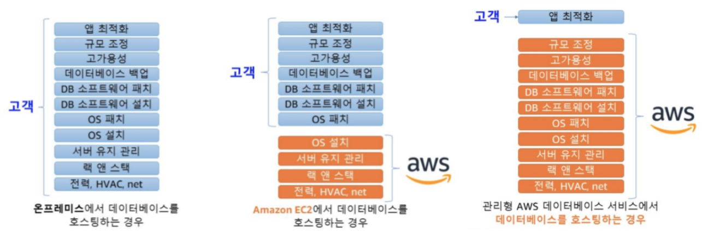

[클라우드 환경에 따른 데이터베이스 관련 필요 작업]

AWS의 데이터베이스 관련 서비스는 **DynamoDB**(NoSQL), **ElasticCache**(In-memory 데이터베이스), **RDS**(RDB), **Aurora**(aws전용 RDB), **Neptune**(graph형태의 데이터 베이스), **Redshift**(데이터 웨어하우스), **DMS**(데이터베이스 마이그레이션 서비스) 등이 있습니다.

### AWS DMS (Database Migration Service)

서비스 중단 없이 데이터베이스의 데이터를 다른 데이터베이스로 무중단으로 이관할 수 있도록 돕는 서비스입니다. DMS는 클라우드에서 클라우드로, 기존 온프레미스 환경에서 클라우드로의 이관 상황 등에 사용할 수 있습니다. 엔진을 변경하려면 AWS SCT(Schema Conversion Tool)을 사용하여 스키마를 새로운 엔진에 맞춰 변환할 수 있습니다.

DMS에 대한 더욱 자세한 내용은 [여기](https://docs.aws.amazon.com/ko_kr/dms/latest/userguide/Welcome.html)에서 확인할 수 있습니다.

### AWS RDS(Relational Database Service)

AWS에서 관계형 데이터베이스(RDBMS)를 더 쉽게 설치, 운영, 관리, 확장할 수 있도록 하는 서비스입니다. 

- **백업**

    RDS는 기본적으로 35일간 저장되는 자동 백업을 실시합니다. 수동으로 "스냅샷"을 생성하여 해당 스냅샷을 기준으로 복원하거나 새로운 데이터베이스를 생성할 수 있습니다.

- **엔진**

    Mysql, MariaDB, PostgreSQL, Oracle, MS SQL 와 같은 엔진을 사용할 수 있습니다. 그 중, Mysql, MariaDB, PostgreSQL 엔진은 읽기 전용 복제본 (Read Replica)를 사용하여 읽기 성능을 향상시킬 수 있습니다.

- **보안**

    이후에 알아볼 IAM(Identity and Access Manager)이라는 AWS서비스 전체를 관통하는 인증 및 인가 서비스를 통해 RDS 데이터 베이스에 액세스 할 수 있는 사용자를 제어할 수 있습니다. 또한 보안 그룹을 통해 RDS로 들어오는 트래픽을 제한할 수 있습니다.

- **고 가용성을 위한 다중 AZ 배포**

    다중 AZ 배포 기능을 사용하면 같은 AWS 리전의 다른 가용 영역에 데이터베이스 예비 복제본을 프로비저닝하고 유지합니다. 이는 Read Replica와는 다릅니다. 마스터-대기 이중화를 통해 마스터 DB에 장애가 발생하면 대기 DB가 작업을 이어 받는 등 장애 조치를 진행할 수 있습니다.

RDS에 대한 더욱 자세한 내용은 [여기](https://docs.aws.amazon.com/ko_kr/AmazonRDS/latest/UserGuide/Welcome.html)에서 확인할 수 있습니다.

### AWS Aurora

Aurora는 AWS에서 Mysql과 PostgreSQL을 바탕으로 만든 "완전 관리형"의 관계형 데이터 베이스 서비스입니다. Aurora는 Mysql의 최대 5배, postgre의 최대 3배의 처리량을 가집니다. 3개의 가용영역에 6개의 데이터 사본을 복제하고, AWS S3에 지속적으로 데이터를 백업하여 99.99%의 가용성을 제공하도록 설계되어 있습니다.
RDS 와 같이, DB 액세스 제어는 IAM 정책을 통해 제한이 가능합니다. 역시 보안 그룹을 통해 트래픽을 제한할 수 있습니다.

AuroraDB에 대한 더욱 자세한 내용은 [여기](https://docs.aws.amazon.com/ko_kr/AmazonRDS/latest/UserGuide/Welcome.html)에서 확인할 수 있습니다.

### AWS DynamoDB

DynamoDB는 AWS의 대표적 완전 관리형 NoSQL 데이터베이스(키-값 및 문서 데이터베이스)입니다. 완전 관리형이므로 인프라에 대한 구성은 필요하지 않고, 읽기 처리 용량(Read Capacity Unit, RCU)과 쓰기 처리 용량(Write Capacity Unit, WCU)을 선택하면 그에 맞게 자동적으로 인프라가 구성되고 그 만큼 과금됩니다. 리전에 제한되지 않고, 보안과 백업, 인메모리 캐싱 기능을 기본적으로 제공합니다.

- **글로벌 테이블**

    Global table을 사용하면 서로 다른 리전에 동일 데이터로 위치하게 됩니다. 따라서, 데이터 요청자의 지리적 위치와 가까운 리전으로부터 데이터를 반환하여 더욱 빠른 성능을 가지며 고 가용성을 제공할 수 있습니다.

DynamoDB에 대한 더욱 자세한 내용은 [여기](https://docs.aws.amazon.com/ko_kr/amazondynamodb/latest/developerguide/Introduction.html)에서 확인할 수 있습니다.

## AWS의 액세스 제어 및 인증, 인가

클라우드 서비스를 활용하는 도중, 보안적 문제가 생기면 어떻게 될까요? 인프라를 내부적으로 관리하는 AWS의 책임일까요? 보안적 기능을 제대로 활용하지 않은 고객의 책임일까요? AWS에서는 "책임 공유 모델"을 통해 어느 영역에서의 보안 문제인지에 따라 책임을 구분하였습니다.

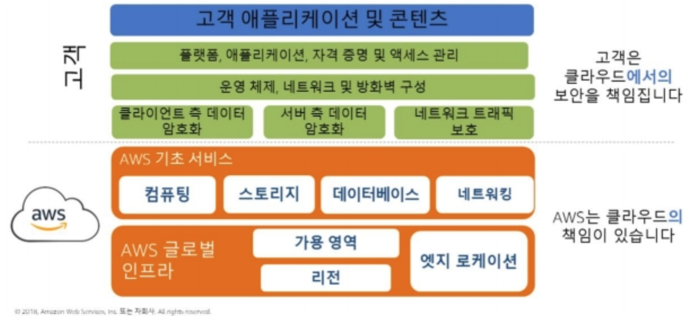

[AWS의 책임 공유 모델]

즉, 고객은 VPC, 보안그룹, ACL, IAM등의 AWS서비스를 활용하여 자사 애플리케이션에 대한 보안과 관련한 부분에 대해 책임집니다.

보안의 기본은 인증(Authentication)과 인가(Authorization)입니다. AWS에서는 모든 **액세스 제어 및 인증, 인가 관리**를 IAM(Identity and Access Management)을 통해 진행할 수 있습니다. IAM 은 CLI, GUI, SDK로 모두 접근 가능합니다.

### IAM(Identity and Access Management)

AWS 계정을 생성하면 "루트 사용자"가 생성됩니다. 이 루트 사용자는 AWS 서비스 및 리소스에 대한 전체 액세스 권한을 갖는 사용자로, 결제 정보, 개인 정보 데이터등을 가지고 있고 강력한 권한을 가져 제한을 받지 않습니다.
권장되는 사항은 루트 사용자를 사용하지 않고, 하위 IAM 사용자를 만들고 해당 사용자에게 권한을 부여하여 사용하는 것입니다. 이제 IAM과 관련된 개념에 대해 알아봅니다.

- **IAM의 자격증명(Entity라고도 함.)**

    AWS가 인증에 사용하는 IAM의 개념입니다. **IAM사용자**, **IAM사용자 그룹**, **IAM역할**이 여기에 포함됩니다.

  - **IAM사용자**는 별도의 AWS 계정이 아닌 **계정 내 사용자**로, 자체 자격 증명(API_key, secret, ...)을 갖습니다. IAM사용자는 자신에게 부여된 권한을 기준으로 AWS 작업을 수행할 수 있습니다. IAM사용자를 생성한 직후에는 부여된 권한은 하나도 없어 필요한 권한을 부여하는 작업을 거쳐야 합니다.
  - **IAM사용자 그룹**은 IAM사용자를 묶어 관리할 수 있도록 합니다. 그룹에 권한(또는 정책)을 부여하여 그 그룹에 속해있는 IAM사용자 모두에게 동일 권한을 부여할 수 있습니다.
  - **IAM역할**은 사용자 또는 서비스, 외부 인증 사용자가 필요한 AWS 리소스에 액세스하기 위한 권한 및 정책 집합을 정의하여 그 것을 한시적으로 위임할 수 있는 기능입니다. 역할의 위임은 AWS콘솔 GUI, AWS STS(Security Token Service) 등으로 처리할 수 있습니다.

- **IAM의 권한 부여**

    IAM에서는 "**정책(Policy)**"으로 하나 이상의 권한을 묶어 IAM 자격증명(사용자/사용자그룹/역할) 또는 AWS 리소스(EC2인스턴스, ...)에 해당 권한을 부여할 수 있습니다. 정책은 여러 권한들에 대해 허용되거나 거부되는 지 여부를 나타낸 JSON 문서입니다. 이 정책에는 **자격 증명 기반 정책**, **리소스 기반 정책** 등이 포함됩니다.

    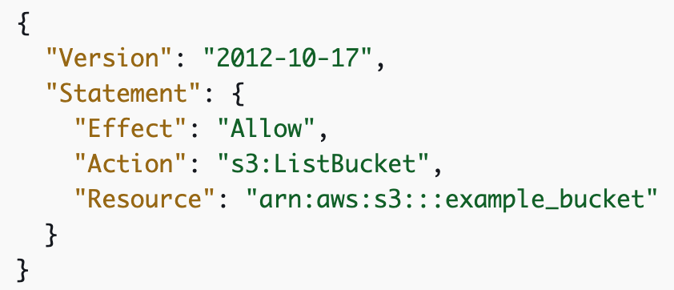
    
[정책 JSON 문서 예시]

  - **자격 증명 기반 정책**은 사용자/사용자 그룹/역할에 연결할 수 있는 JSON 정책 문서입니다. 이는 해당 자격증명이 수행할 수 있는 작업, 작업의 대상, 작업 수행 조건 등을 제어합니다. 자격 증명 기반 정책을 더욱 세분화 하면 **관리형 정책**과 **인라인 정책**으로 나눌 수 있습니다.
        - 관리형 정책은 사용자/그룹/역할에 연결할 수 있는 정책이고, AWS 자체에서 생성하여 관리하는 **AWS 관리형 정책**이 있고, 스스로 관리형 정책을 만들어 사용하는 **고객관리형 정책**을 사용할 수도 있습니다. 대부분의 경우, 먼저 AWS 관리형 정책을 사용하는 것을 권장합니다.
        - 인라인 정책은 스스로 생성한 일회성의 정책으로 사용자/사용자그룹/역할에 곧바로 연결할 수 있습니다. 재 사용성이 낮고 관리가 힘들며 뒤죽박죽이 될 우려가 있어, 예외의 경우에만 사용합니다.
  - **리소스 기반 정책**은 S3 버킷과 같은 리소스에 연결하는 JSON 정책 문서입니다. AWS 리소스에 대한 특정 작업을 수행할 수 있는 권한과 권한의 적용 조건을 정의합니다. 모든 리소스 기반 정책은 인라인 정책입니다. 따라서, 재사용성이 떨어집니다.

- **IAM의 권한 평가**

    IAM은 권한에 대한 평가가 다음과 같은 순서로 진행됩니다.

    1. 요청되는 작업이 **명시적으로 거부**되어 있는가?
    2. 요청되는 작업이 명시적으로 허용되어 있는가?

    즉, **언제나 거부가 우선적으로 적용**됩니다. 특정 권한에 대한 허용과 거부가 함께 명시되면 그 권한은 거부된 것으로 간주합니다.  
    이에 더해서, AWS에서 정책을 생성할 때 권장되는 사항은, 권한을 허용 시 `*`(모두를 표시)를 사용하지 않고 권한을 정확히 명시하며, 특정 리소스에 대한 권한을 Deny로 모두 막은 뒤, NotResource 필드로 허용되는 권한을 하나 하나 풀어주는 것입니다. 보안은 언제나 보수적인 것이 좋습니다.

### AWS Cognito

**Cognito**는 웹 및 모바일 앱에 대한 인증, 권한 부여 및 사용자 관리를 제공하는 완전 관리형 서비스입니다. Cognito를 통해 인증 및 권한 관리를 하는 애플리케이션의 사용자는 Id와 password를 통해 직접 로그인하거나, Facebook, Apple, Amazon, Google, OIDC 등의 타사 자격증명 공급자를 활용해 로그인할 수 있습니다.  
Cognito는 사용자 인증(Authentication) 과 관련한 사용자 정보를 담아 두는 **사용자 풀**과 액세스 권한 인가(Authorization)와 관련한 정보를 담아 두는 **자격 증명 풀**을 가지고 있습니다.  

Cognito에 대한 더욱 자세한 내용은 [여기](https://docs.aws.amazon.com/ko_kr/cognito/latest/developerguide/what-is-amazon-cognito.html)에서 확인할 수 있습니다.

### AWS LandingZone

AWS LandingZone은 모범 사례에 따라 안전한 다중 계정 AWS 환경을 빠르게 설정할 수 있게 도와주는 솔루션입니다. 하나의 계정 상에서의 액세스 제어는 IAM이 담당하지만, 다중 계정으로 AWS서비스를 사용하는 경우 LandingZone을 사용할 수 있습니다. Account Vending Machine으로 AWS 계정을 프로비저닝하고 배포할 수 있습니다.  
조직이 커질 수록 VPC로 워크로드를 분리하기 보다 여러 AWS 계정으로 분리하는 것이 좋습니다.  

LandingZone에 대한 더욱 자세한 내용은 [여기](https://aws.amazon.com/ko/solutions/implementations/aws-landing-zone/)에서 확인할 수 있습니다.

## 고가용성을 위한 AWS의 서비스

안정적인 서비스를 제공하기 위해서는 "**모든 기능은 장애가 발생한다**" 라는 전제 하에 역방향으로 설계하는 것이 좋습니다. 가능한 모든 지점에서 이중화를 통해 중복성을 구현하여, 단일 장애로 인해 전체 시스템이 중단되지 않도록 해야 합니다.

고 가용성은 오랜 기간동안 지속적으로 정상 운영이 가능한 성질을 말합니다. 가령 예상치 못한 사용량의 증가가 생겼다면, 기존 온프레미스 환경에서는 그야말로 지옥입니다. 처리량을 버티지 못해 서버가 다운되거나 제대로 작업을 처리하지 못할 수 있었습니다. 이런 상황을 예방하기 위해, 많이 쓰일 수 있는 용량 정도를 예측하여 인프라를 그에 맞추어 구성했습니다. 하지만 이는 인프라 자원의 낭비를 불러왔습니다. 가끔은 준비한 용량을 넘는 트래픽이 생기기도 하여 인프라 구성자는 난처할 뿐이었습니다.

AWS 에서는 고가용성을 만족하기 위한 여러 방식을 제공합니다. 예로, 하나의 리전에 여러 가용 영역을 두거나, 데이터베이스를 여러 가용영역에 배포하거나 로드밸런서가 대상의 상태를 체크하여 잘 작동하고 있는 인스턴스로만 트래픽을 보내기도 합니다.

- **고가용성의 요소**
  - **내 결함성**: 애플리케이션 구성 요소의 내장된 중복성을 말합니다.
  - **복구성**: 재해 발생 후 서비스 복구와 관련된 프로세스, 정책 및 절차를 말합니다.
  - **확장성**: 애플리케이션의 설계 변경 없이 성장을 수용하는 능력을 말합니다.

    위의 세가지 요소가 만족될 때 고 가용성을 가졌다고 말할 수 있습니다. 이 중 확장성은 탄력성이라고도 말할 수 있습니다. 탄력성이 없는 경우, 앞에서의 온프레미스 예시와 같이 너무 많은 리소스를 추가하여 더욱 많은 비용을 부담해야 합니다. 이 탄력성은 인프라의 용량 요구사항의 변화에 따라 지능적으로 확장 및 축소될 수 있음을 의미합니다. 탄력성은 다시 세 가지로 나누어 바라볼 수 있습니다.

  - **시간 기반 탄력성**: 리소스가 사용되지 않을 때 리소스를 점유하지 않고, 필요할 때 리소스를 사용하도록 조정하는 것을 의미합니다.
  - **볼륨 기반 탄력성**: 수요 용량 강도에 맞게 규모를 조정하는 것을 의미합니다.
  - **예측 기반 탄력성**: 기계학습을 통해 일일 및 주간 추세를 기반으로 향후 트래픽을 예측하여 정기적으로 규모를 조정하는 것을 의미합니다.

    자동적으로 탄력성을 만족할 수 있기 위해서는 **인프라 서비스에 대한 모니터링은 필수적**입니다. AWS 에서는 AWS 내부의 서비스를 전사적으로 모니터링할 수 있는 AWS CloudWatch 서비스를 제공합니다.

### AWS CloudWatch

CloudWatch는 **AWS 리소스에 대한 지표를 수집하고 추적**합니다. 설정한 임계값에 근거해 경보를 생성하고 알림을 전송할 수 있으며, 설정한 규칙에 따라 특정 작업을 트리거할 수 있습니다.

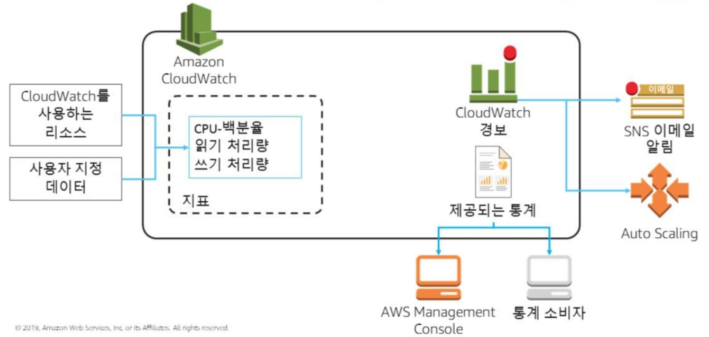

[CloudWatch의 기능]

CloudWatch는 AWS 리소스 내부에 위치한 애플리케이션에서 나타나는 로그에 대한것은 수집하지 않습니다. 인프라 구성이 어떻게 동작되고 있는지, 사용량은 얼마나 되는지, 네트워크 밴드위쓰는 어느정도 사용되고 있는지 등과 같은 클라우드 리소스에 대한 지표를 수집합니다. AWS리소스 내부에 위치한 애플리케이션 로그를 모니터링하고 저장 및 액세스하는 것는 **CloudWatch Logs**를 통해 할 수 있습니다.  
CloudWatch Logs는 AWS 서비스에 있는 다양한 애플리케이션의 중앙집중화 하여, 손쉽게 특정 오류 코드나 패턴을 검색하거나 특정 필드를 기준으로 필터링 하거나 향후 분석을 위해 안전하게 보관할 수 있습니다.

- **경보(Alarms)**

    경보는 지정한 기간에 단일 지표를 검사해 시간에 따른 임계값에 대한 지표 값을 기준으로 지정된 하나 이상의 작업을 수행할 수 있습니다. 이 작업은 AWS SNS(Simple Notification Service)의 Topic 이나, Auto Scaling 정책에 알림을 보내는 것과 같은 일입니다.  
    다양한 지표를 기반으로 여러 많은 경보를 생성할 수 있습니다. 경보는 단순히 임계값을 지났다는 것만이 아니라 지정된 기간 수 동안 해당 임계를 넘은 값이 지속되었는지를 확인합니다.

- CloudWatch함께 사용되는 서비스: **AWS CloudTrail**

    CloudTrail은 AWS 계정 내 모든 API 호출(SDK, GUI, CLI)과 활동을 기록하여 S3에 저장하여 확인할 수 있도록 돕는 서비스입니다. AWS GUI 콘솔의 모든 작업은 내부적으로 API를 호출합니다. 그러므로 어떤 작업을 처리하였는지 확인하고 검색, 다운로드, 보관할 수 있습니다.  
    CloudTrail은 AWS 계정에서 기본적으로 활성화되어 있습니다.  
    CloudTrail에 대한 더욱 자세한 내용은 [여기](https://docs.aws.amazon.com/ko_kr/awscloudtrail/latest/userguide/cloudtrail-user-guide.html)에서 확인할 수 있습니다.

- CloudWatch함께 사용되는 기능: **VPC Flow Logs**

    VPC Flow Logs는 VPC의 네트워크 인터페이스에서 전송되고 수신되는 IP 트래픽에 대한 정보를 수집할 수 있는 기능으로, 해당 로그를 CloudWatch Logs 또는 S3에 게시할 수 있습니다.  
    VPC Flow Logs에 대한 더욱 자세한 내용은 [여기](https://docs.aws.amazon.com/ko_kr/vpc/latest/userguide/flow-logs.html)에서 확인할 수 있습니다.

CloudWatch에 대한 더욱 자세한 내용은 [여기](https://docs.aws.amazon.com/ko_kr/AmazonCloudWatch/latest/monitoring/WhatIsCloudWatch.html)에서 확인할 수 있습니다.

### AutoScaling

탄력성을 만족하기 위해 AWS에서는 다양한 서비스에서 AutoScaling 기능을 지원하고 있습니다. 가장 기본적으로 EC2 인스턴스에 대한 AutoScaling 기능이 있습니다. 해당 기능을 활성화 하면, 지정된 조건에 따라 EC2인스턴스를 시작하거나 종료할 수 있습니다. ELB와 함께 사용 시, 자동으로 새 인스턴스를 대상으로 등록해 주는 등의 작업을 하기도 합니다.

- **Auto Scaling 자동 조정 방법**

    Auto Scaling의 조정 방법은 앞서 살펴봤던 탄력성의 세 가지 요소와 연결될 수 있습니다.

  - 시간 기반 탄력성 - **예약 조정**

      예측 가능한 워크로드에 적합합니다. 시간 또는 날짜를 기준으로 리소스를 조정하는 방법입니다.
      예로, 은행업무의 경우 4시~6시는 정산 트래픽이 활발하게 일어나므로, 이 시간대에 리소스를 더욱 확보하도록 예약 조정해 둘 수 있습니다.

  - 볼륨 기반 탄력성 - **동적 조정**

      일반적인 워크로드에 적합합니다. **"대상 추적"**을 통해 대상에 임계값을 설정하여 해당 임계값의 상황에 따라 리소스를 조정하도록 하는 방법입니다.

  - 예측 기반 탄력성 - **예측 조정**

      AWS의 기계학습 기반으로 생성된 모델에 의해 자동적으로 확장, 축소하는 방법입니다. 규칙을 수동으로 조정할 필요 없이 가장 간편한 조정방법입니다.

EC2의 경우 자동 조정 및 관리를 위해 Auto Scaling 그룹을 정의하여야 합니다. 원하는 용량, 최소 용량, 최대 용량(인스턴스 개수) 및 인스턴스 구매 옵션, 인스턴스 시작 구성 등을 설정하여 관리합니다.

Auto Scaling은 둘 이상의 지표를 사용하여 조정하도록 할 수 있으며, 조기에 빠르게 확장하고 시간이 지나면서 천천히 축소되는 방식을 취하고 있습니다.  
"수명 주기 훅"으로 인스턴스의 시작 및 종료 시 실행할 작업을 수행하도록 할 수 있습니다. 대개 상태 정보를 갖는 애플리케이션의 경우 애플리케이션이 가지고 있던 상태를 따로 저장하는 작업 등에 사용됩니다.

### 데이터베이스의 탄력성

- **읽기 복제본**

    대부분의 데이터베이스에서 가장 많이 실행되는 작업은 읽기 작업입니다.
    RDS의 경우, 읽기 중심의 워크로드를 수평적으로 확장하기 위해 읽기 복제본(Read Replica)을 생성할 수 있습니다. 이를 통해 더 높은 탄력성을 제공할 수 있습니다. RDS는 최대 5개까지 구성할 수 있는 반면, AWS Aurora의 경우 최대 15개까지 구성할 수 있습니다.

    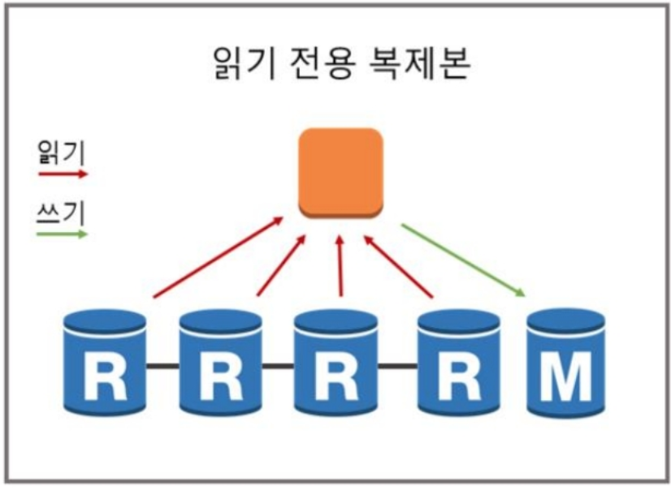
    
[RDS의 Read Replica를 통한 탄력성 향상]

- **규모 조정**

    또한, 데이터 베이스의 규모를 수직적으로 확장할 수 있습니다. 다중 AZ 배포를 구성해 두었다면 다운 타임 없이 규모 조정이 가능합니다. 2019년 6월 이후로 현재는 RDS의 스토리지 용량에 대한 Auto Scaling 기능이 출시되어, 가동 중단없이 스토리지 용량을 자동으로 확장할 수 있습니다.

- **DynamoDB의 탄력성**

      AWS 에서 제공하는 NoSQL DynamoDB의 경우 완전 관리형으로 RCU, WCU 값을 지정하면 자동적으로 Auto Scaling 됩니다.

  EC2의 오토스케일링에 대한 더욱 자세한 내용은 [여기](https://docs.aws.amazon.com/ko_kr/autoscaling/ec2/userguide/what-is-amazon-ec2-auto-scaling.html)에서,  RDS의 읽기 전용 복제본에 대한 더욱 자세한 내용은 [여기](https://docs.aws.amazon.com/ko_kr/AmazonRDS/latest/UserGuide/USER_ReadRepl.html)에서 확인할 수 있습니다.

### 다중 리전 차원의 고 가용성 - AWS Route53

Route53은 가용성과 확장성이 뛰어난 **AWS의 DNS(Domain Name System)**로, 엣지 로케이션 위에서 기능하고 있는 서비스입니다. Route53은 DNS 상태확인 기능을 제공하므로 고 가용성 확보에 도움을 줍니다. 주 사이트, 예비 사이트를 가리키는 레코드 세트를 만들고 주 사이트를 상태확인 이후 문제가 발견되면 예비 사이트로 응답을 처리할 수 있도록 합니다.

Route53에 대한 더욱 자세한 내용은 [여기](https://docs.aws.amazon.com/ko_kr/Route53/latest/DeveloperGuide/Welcome.html)에서 확인할 수 있습니다.

## 인프라 스트럭처 자동화

매번 수동으로 컴퓨팅 환경을 조성하는 것은 시간적, 인적 자원을 많이 소모합니다. 동일한 구조를 가지는 여러 환경의 인프라를 구축하는 경우 이 반복 작업은 고역이 될 수 있습니다. 또한 사람의 힘이 들어가면 실수를 유발하기 쉽습니다.
장애 조치의 차원에서도 수동으로 조성한 환경보다, 자동적으로 조성된 환경에서의 조치가 쉽습니다. 일반적으로, 프로덕션 환경에서 수동으로 뭔가를 변경해야 하는 경우 위험이 따릅니다. 수동 프로세스는 **확장이 불가**하며, **버전 제어가 없고**, **감사 내역이 부족**하며, **일관성 없이 데이터를 관리**하게 되기 쉽습니다.

### AWS CloudFormation

**코드로 인프라를 관리**하는 것을 IaC(Infrastructure as a Code)라고 합니다. AWS에서는 CloudFormation, CDK 등을 통해 IaC를 가능하게 합니다.  
CloudFormation은 AWS 인프라를 설명하는 공통 언어인 **CloudFormation Template**로 설명된 리소스를 자동화된 방식으로 생성하고 구축하는 서비스입니다. 동일한 인프라를 여러 번 생성하는 등 재사용성이 매우 향상됩니다.  
또한 JSON과 YAML형식을 지원하고 코드로 취급하므로 Git, SVN, AWS CodeCommit과 같은 버전 관리 시스템으로 관리할 수 있습니다.  
인프라에 대한 CloudFormation Template을 작성할 때, 마이크로 서비스 아키텍처를 구성하는 것과 같이 서비스나 인프라를 기준으로 나누어 CloudFormation템플릿을 작성하는 것이 좋습니다.

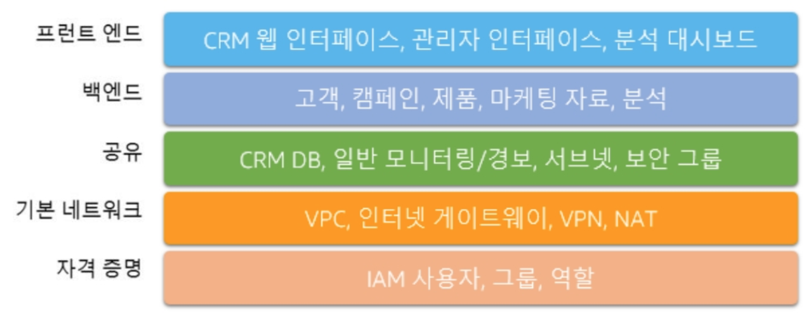

[마이크로 인프라 구성]

- **Stack**은 AWS 리소스 모음 단위입니다. 이 스택을 생성, 업데이트, 삭제하여 AWS 리소스 모음을 생성, 업데이트, 삭제할 수 있습니다. Stack의 모든 리소스는 CloudFormation Template에 의해 정의됩니다. CloudFormation은 Stack의 드리프트 감지 기능으로 스택의 변경 정보를 추적하여 더욱 효율적이고 편안하게 인프라를 변경, 추가, 제거 할 수 있습니다.

CloudFormation에 대한 더욱 자세한 내용은 [여기](https://docs.aws.amazon.com/ko_kr/AWSCloudFormation/latest/UserGuide/Welcome.html)에서 확인할 수 있습니다.

### AWS CDK(Cloud Development Kit)

CDK(클라우드 개발 키트)는 **익숙한 프로그래밍 언어를 사용하여 클라우드 애플리케이션 리소스를 모델링하고 프로비저닝 할 수 있는 오픈소스 개발 프레임워크**입니다. Typescript,  Python, C#, Java등의 프로그래밍 언어로 클라우드 인프라를 정의할 수 있습니다. 익숙한 프로그래밍 언어로 작성된 인프라는 CloudFormation Template으로 변환되고, 이 템플릿을 기준으로 CloudFormation Stack을 만들어 인프라를 프로비저닝 하거나 인프라 구성을 변경합니다.

CDK에 대한 더욱 자세한 내용은 [여기](https://docs.aws.amazon.com/cdk/latest/guide/home.html)에서 확인할 수 있습니다.

### AWS System Manager

System Manager는 대규모 클라우드 리소스에 대한 자동화된 관리를 돕는 서비스입니다. 애플리케이션 버전 업그레이드 및 패치 적용 등의 작업에 대해 자동화된 구성으로 대규모 시스템의 지속적 관리를 돕습니다.System Manager에는 다음과 같은 기능이 있습니다.

- 여러 인스턴스에 걸친 명령 실행
- 유지 관리 스케쥴링
- 소프트웨어 버전 업그레이드 및 패치 관리
- IAM 사용자에게 SSH등 보안 채널을 통해 인스턴스로 직접 접근하는 등의 세션 관리
- 인스턴스의 상태를 관리

SystemManager에 대한 더욱 자세한 내용은 [여기](https://docs.aws.amazon.com/ko_kr/systems-manager/latest/userguide/what-is-systems-manager.html)에서 확인할 수 있습니다.

## AWS에서의 캐싱

데이터에 대한 요청을 더 빠르게 처리할 수 있도록하는 캐싱을 사용하면 **이전에 검색하거나 계산한 데이터를 효율적으로 재사용**할 수 있습니다. 성능 측면과 비용 측면에서 아주 중요한 기술입니다.

대부분의 애플리케이션에서 데이터는 **사용자 ⇒ 엣지/인터넷 ⇒ 웹 ⇒ 앱 ⇒ 데이터베이스**의 여정을 거치게 됩니다.

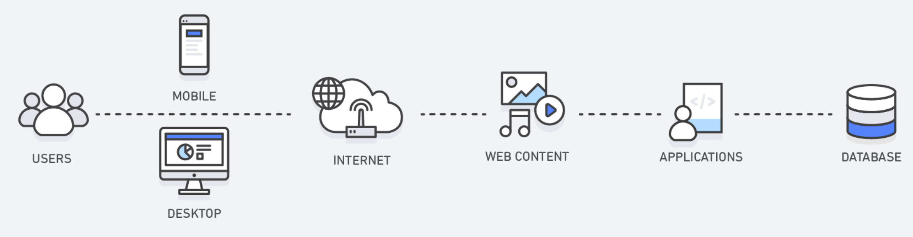

[웹서비스에서 데이터의 흐름]

### AWS CloudFront

- **"사용자 ⇒ 엣지/인터넷" 수준**에서의 캐싱

CloudFront는 AWS의 대표적 글로벌 CDN(Contents Delivery Network) 서비스입니다. 전 세계적으로 퍼져 있는 AWS의 글로벌인프라 중 엣지 로케이션 위에서 서비스 됩니다. 엣지로케이션 메모리를 확인한 이후 캐싱된 컨텐츠가 있다면 엣지로케이션에서 곧바로 전송하고, 없다면 고객과 가까운 위치의 오리진으로부터 데이터를 가져오는 동작을 실행합니다. "오리진"은 데이터의 출처를 의미합니다. ELB, EC2, S3와 같은 AWS 서비스가 해당 데이터의 출처인 경우, CloudFront는 비용이 없습니다. 또한 AWS Shield와 연동되어 DDoS완화 작업을 수행합니다. 이미지, html, css, js, 정적 웹 콘텐츠, 동적 웹 콘텐츠를 사용자에게 더욱 빠르게 배포할 수 있습니다.

CloudFront에 대한 더욱 자세한 내용은 [여기](https://docs.aws.amazon.com/ko_kr/AmazonCloudFront/latest/DeveloperGuide/Introduction.html)에서 확인할 수 있습니다.

### AWS ElastiCache

- **"데이터베이스 수준"**에서의 캐싱

ElastiCache는 클라우드에서 분산된 인 메모리 데이터 스토어 또는 캐시 환경을 손쉽게 설정하고 관리하며 확장할 수 있는 서비스입니다. 1밀리초 미만의 지연시간을 목적으로 하는 등 빠른 속도가 필요한 작업에 적합한 서비스입니다.

부하가 큰 대용량 쿼리의 결과를 기억해 두었다가 동일 요청이 오면 데이터베이스가 다시 한번 쿼리 작업을 실행할 필요 없이 곧바로 결과를 전송할 수 있습니다. 따라서 ElastiCache를 통해 애플리케이션의 부하가 넘치는 것을 방지하고, 데이터베이스 작업 처리 비용을 줄일 수 있습니다.

- **엔진**

    ElastiCache는 `Redis`, `Memcached` 엔진 중 하나를 사용할 수 있습니다.

    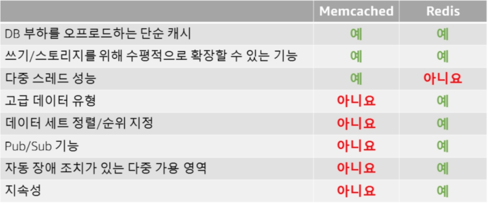
    
[ElastiCache - Redis와 Memcached 비교]

ElastiCache의 Redis엔진에 대한 더욱 자세한 내용은 [여기](https://docs.aws.amazon.com/ko_kr/AmazonElastiCache/latest/red-ug/WhatIs.html)에서, Memcached에 대한 더욱 자세한 내용은 [여기](https://docs.aws.amazon.com/ko_kr/AmazonElastiCache/latest/mem-ug/WhatIs.html)에서 확인할 수 있습니다.

## AWS에서의 리소스 결합 해제

AWS 상에서 리소스가 지속적으로 추가되면 복잡성은 배로 증가합니다. 인프라 구성 요소들이 강력하게 결합되어 있는 것을 "밀 결합 된" 아키텍처라고 표현합니다. 각 리소스는 다른 리소스와 직접적으로 통신하여 결합되어 있는 형태가 이에 속합니다.

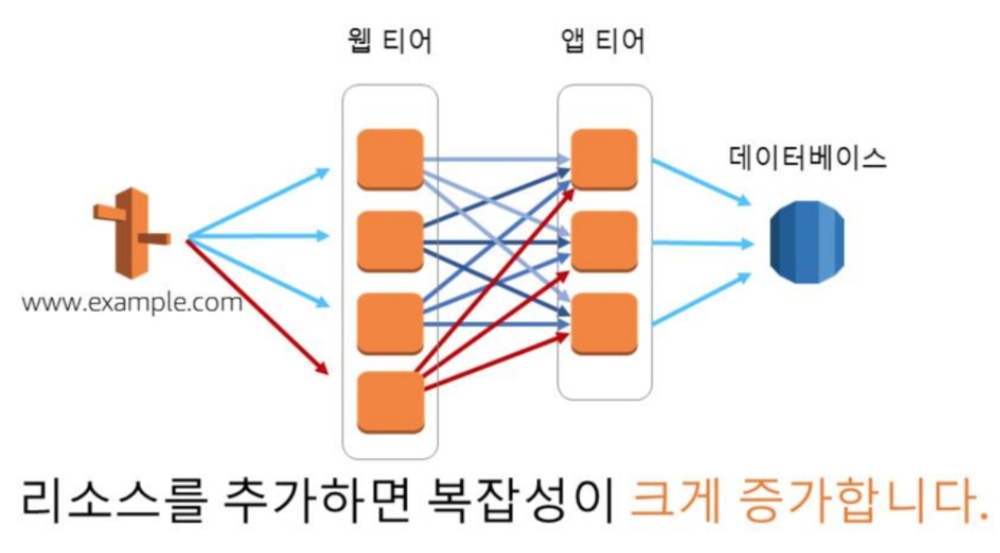

[밀결합된 아키텍처]

밀 결합 해제된 아키텍처를 "소 결합" 되어있다고 표현합니다. 각 계층 사이에 ELB를 두어 통신의 일관화를 구성하여 밀결합 해제 할 수 있습니다.

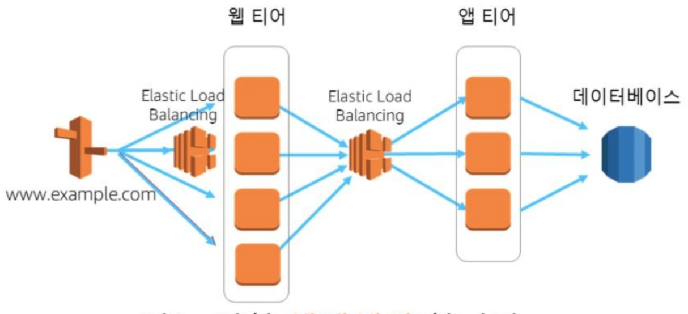

[소결합된 아키텍처]

### AWS SQS(Simple Queue Service)

SQS는 호스팅 대기열을 제공하여 분산 소프트웨어 시스템과 구성 요소를 통합 및 분리할 수 있도록 도와줍니다. 완전 관리형 분산 메시지 대기열 서비스로, 메시지는 처리 및 삭제될 때까지 저장됩니다. 각 서비스 티어간의 데이터 요청을 버퍼링하는 레이어로 사용 가능합니다.
SQS 대기열을 사용하면 비동기식 처리를 사용해 신속하게 응답할 수 있고 AutoScaling과 연결하여 작업 인스턴스 수를 늘려 성능 및 요구사항을 처리할 수 있으며, 메시지가 대기열에 남아있기 때문에 실패한 단계에서 쉽게 복구가 가능합니다.

SQS에 대한 더욱 자세한 내용은 [여기](https://docs.aws.amazon.com/ko_kr/AWSSimpleQueueService/latest/SQSDeveloperGuide/welcome.html)에서 확인할 수 있습니다.

### AWS SNS(Simple Notification Service)

SNS는 구독중인 endpoint 또는 클라이언트에 메세지 전달 또는 전송을 조정 또는 관리하는 서비스입니다. Subscriber와 Publisher의 개념으로 나누어져 있으며, 어떤 Publisher와 Subscriber와 Topic을 통신할 지 결정하는 정책을 설정해 메시지에 대한 액세스를 제어합니다.

대개 SNS는 이메일링, 문자SMS, HTTP/HTTPS 요청, 푸시 이메일 및 푸시알림, SQS 알림, Lambda함수 트리거 등으로 사용될 수 있습니다.

SNS에 대한 더욱 자세한 내용은 [여기](https://docs.aws.amazon.com/ko_kr/sns/latest/dg/welcome.html)에서 확인할 수 있습니다.

SQS와 SNS를 이용해 결합을 해제한 아키텍처는 다음과 같을 수 있습니다. 예시는 인스타그램과 같은 소셜네트워크 서비스에서 이미지가 업로드 되었을 때, 이미지에 대한 특정 작업을 실행한 뒤 S3버킷에 업로드하고 CloudFront를 통해 전 세계적으로 배포하는 과정을 나타냅니다.

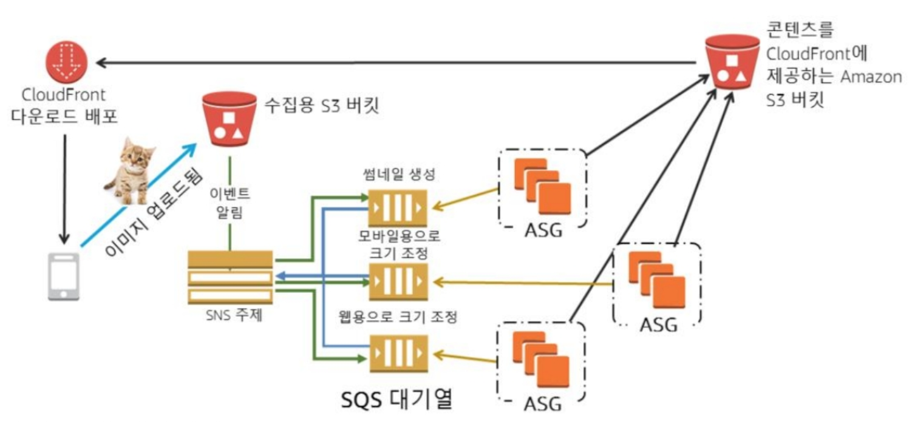

[SQS와 SNS를 통해 결합 해제된 소셜네트워크 이미지 변환 서비스 아키텍처]

잠깐 덧붙여 말하자면, ASG(AutoScalingGroup)와 S3의 통신이 현재 같은 AWS 계정 내에서 진행되고 있다는 점에서 보완할 점이 있을 수 있습니다. VPC Endpoint를 이용하여 AWS 내부적 통신망으로 통신할 수 있도록 변경할 수 있을 것입니다. 또한, 이미지 변환 작업은 큰 컴퓨팅 파워를 요구하는 작업이 아니므로 후에 설명할 AWS Lambda라는 서비스를 통해 처리할 수 있습니다.

## AWS에서의 마이크로 서비스 아키텍처

마이크로서비스는 **잘 정의된 API를 통해 통신하는 소규모의 독립적인 서비스로 구성되어 있는 아키텍처** 구성을 말합니다. 하나의 서비스는 대개 독립적인 소규모 팀에서 개발하고 관리합니다.

기존 모놀리식 아키텍처의 경우 **모든 프로세스가 긴밀하게 결합되고 단일 서비스로 실행**되었습니다. 단일 서비스 위에서 특정 기능에 대한 수요의 증가가 발생하면 아키텍처 전체의 컴퓨팅 자원을 확장해야 했습니다. 더불어 서비스가 지속적으로 성장하면서 코드베이스가 방대해지고 복잡해져, 새로운 기능을 추가하거나 개선하는 작업의 부담이 기하급수적으로 늘어났습니다.

이에 반하여 마이크로서비스 아키텍처의 경우 각 기능별 서비스가 **독립적인 구성요소로 구축**되고, 각 서비스는 **잘 정의된 API를 통해서 서로 통신**합니다. 서비스가 독립적으로 실행되고 독립적으로 관리되므로 기능의 추가 및 개선이 비교적으로 간단해졌습니다.  
하지만 이를 무조건 진보된 아키텍처라고는 말할 수 없습니다. 각 서비스가 서로 통신하므로 마이크로 서비스 아키텍처가 잘 기능하기 위해서는 필수적으로 잘 정의된 API가 필요합니다. 또한 서비스 간 원활한 통신 프로세스에 대해 정립된 문서와 서비스 검색과 서비스 메시 같은 통신을 돕는 기술이 필요합니다.  더불어 많은 서비스들을 통합적으로 관리할 수 있는 Docker Swarm, Kubernetes 등의 기술에 대한 이해도 필수적입니다.

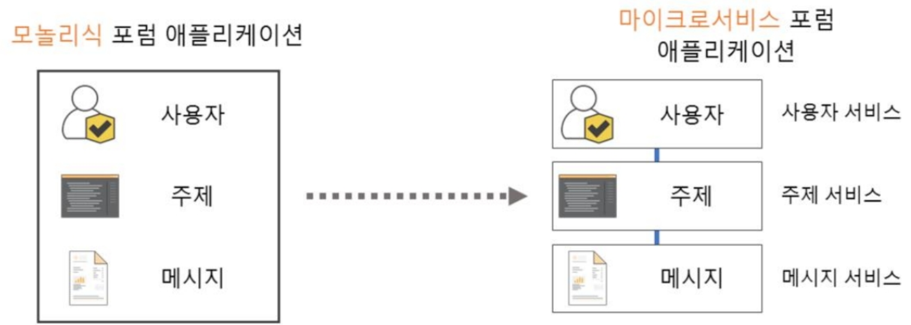

[기존 모놀리식 아키텍처와 마이크로 서비스 아키텍처]

AWS 에서는 마이크로 서비스 아키텍처를 위한 서비스로 **AWS ECS(Elastic Container Service)**와 **EKS(Elastic Kubernetes Service)**, **AWS Lambda** 등을 제공합니다. **SNS**, **SQS**와 같은 메시징 서비스와 **ELB**, **Route53**, **API Gateway** 등 네트워킹 및 컨텐츠 전송 서비스는 ECS, EKS등과 함께 사용되어 통신을 원활하게 할 수 있도록 돕습니다.

### AWS ECS(Elastic Container Service)

ECS는 클러스터에서 도커 컨테이너를 손쉽게 실행, 중지, 관리할 수 있게 해주는 서비스입니다. ECS는 리전내의 여러 가용영역에 걸쳐 컨테이너를 관리합니다. VPC 내에 ECS 클러스터를 생성하고, 컨테이너 작업에 대한 정보를 작성한 문서인 "작업 정의"를 활용해 컨테이너 실행을 관리합니다.

- **시작 유형**

    ECS는 기존에 존재하는 EC2 상에서 컨테이너 관리 서비스만 이용하는 **EC2 시작 유형**과 완전 관리형으로 인프라를 프로비저닝 하거나 구성할 필요 없는 **Fargate 시작 유형**이 있습니다. EC2 시작 유형을 사용하면 인프라에 대한 더욱 세부적인 제어가 가능합니다.

- **컨테이너 및 이미지**

    ECS에서 애플리케이션을 배포하려면 **컨테이너**에서 실행되도록 구축되어야 합니다. 도커 컨테이너는 애플리케이션에 필요한 모든 환경을 포함하는 단위입니다. 도커 컨테이너에 대한 더욱 자세한 내용은 [여기](https://www.docker.com/resources/what-container)에서 확인할 수 있습니다.  
    **이미지**는 컨테이너에 포함되는 모든 구성 요소를 지정하는 Dockerfile 로부터 빌드되는 AWS EC2의 AMI와 같은 템플릿입니다. ECS에서는 **AWS ECR(Elastic Container Registry)** 또는 Docker Hub에 저장된 이미지를 다운로드해 클러스터에서 컨테이너화 하는 데에 사용합니다.

- **작업 정의**

    ECS에서 애플리케이션을 실행하도록 하기 위해서는 **"작업 정의"**를 생성해야 합니다. 작업 정의는 **애플리케이션을 구성정보를 JSON 문서로 정의**한 것입니다. 작업 정의에는 컨테이너 생성에 사용할 이미지와 사용할 시작 유형(Fargate 또는 EC2시작유형), 작업에서 개방할 포트, 컨테이너에 사용할 볼륨, 컨테이너에 주입할 파라미터등에 대한 정보를 기재합니다.

    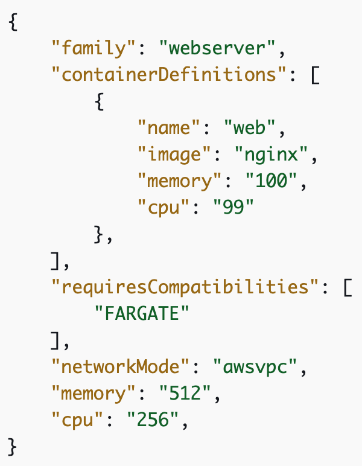
    
[작업 정의 예시]

- **작업 및 예약**

    **작업**은 클러스터 내 작업 정의를 인스턴스화 한 것입니다. Fargate 시작 유형을 사용하는 작업은 다른 작업과 CPU, 메모리, Network Interface, 커널을 공유하지 않는 자체 격리 경계를 포함합니다.

    **작업 스케쥴러는** 클러스터 내에 작업을 배치하는 일을 맡습니다. cron문법, 시간 설정 등 다양한 예약 옵션을 사용하여 작업 정의를 기반으로 작업을 자동적으로 실행시킬 수 있습니다.

    **서비스**는 지정된 개수의 작업을 동시에 실행 및 관리하는 등, 특정 작업을 그룹 관리할 수 있도록 합니다.

- **클러스터**

    ECS 를 사용하여 작업을 실행하면 리소스의 논리적 그룹인 클러스터에 작업을 배치하는 것입니다. **Fargate 시작 유형의 경우, ECS에서 내부적으로 클러스터 리소스를 관리**합니다.  
    **EC2 시작 유형의 경우, 클러스터는 사용자가 관리하는 컨테이너 인스턴스의 그룹이 됩니다**. 여기서 "컨테이너 인스턴스"는 ECS 컨테이너 에이전트를 실행하는 EC2 인스턴스를 말합니다.

    다시 말해, 작업이 시작될 때 ECS는 사용자가 지정한 레지스트리(ECR or DockerHub)에서 이미지를 다운로드하여 그 이미지를 **클러스터 내에서 실행하여 컨테이너로 만듭니다**. 그 컨테이너를 관리하고 조정하는 단위가 "작업"입니다.

- **컨테이너 에이전트**

    **컨테이너 에이전트**는 ECS 클러스터의 각 인프라 리소스에서 실행됩니다. 리소스에서 현재 실행 중인 작업과 사용률 등에 대한 정보를 ECS에 전송하고, 작업을 실행, 중지합니다.  
    Fargate 시작 유형의 경우, 컨테이너 에이전트는 AWS 에서 내부적으로 관리하는 인프라에 설치되어 작동합니다.  
    EC2 시작 유형의 경우, ECS 컨테이너 인스턴스 AMI를 사용한 경우 기본적으로 포함되어 있고, 그렇지 않은 경우 수동으로 설치할 수 있습니다. 컨테이너 에이전트의 코드를 확인하고 싶다면 [Github Repository](https://github.com/aws/amazon-ecs-agent)에서 확인할 수 있습니다.

- **ECS의 탄력성 - 자동 조정**

    자동 조정은 ECS 서비스에서 원하는 작업 수를 자동으로 늘리거나 줄이는 기능입니다. 이 작업은 [Application Auto Scaling](https://docs.aws.amazon.com/ko_kr/autoscaling/application/userguide/what-is-application-auto-scaling.html) 이라는 EC2 이외의 AWS 서비스에 제공되는 AutoScaling 도구를 통해 진행됩니다.  
    ECS는 서비스의 평균 CPU 및 메모리 사용량을 CloudWatch 지표로 게시합니다. 이 지표를 활용하여 임계값을 설정해 작업의 수를 늘리거나 줄일 수 있습니다. 대상 추적, 단계조정, 예약된 조정 등의 자동 조정 유형을 제공합니다. 원하는 방식으로 사용할 수 있습니다. ECS의 AutoScaling에 대한 더욱 자세한 내용은 [여기](https://docs.aws.amazon.com/ko_kr/AmazonECS/latest/developerguide/service-auto-scaling.html)에서 확인할 수 있습니다.

ECS에 대한 더욱 자세한 내용은 [여기](https://docs.aws.amazon.com/ko_kr/AmazonECS/latest/developerguide/Welcome.html)에서 확인할 수 있습니다.

### AWS ECR(Elastic Container Registry)

ECR은 AWS의 DockerHub와 같은 관리형 도커 레지스트리 서비스입니다. ECR은 AWS IAM을 사용하여 Private Repository를 지원하여, 특정 인가된 사용자만 Repository에 접근하도록 할 수 있습니다. 

ECR에 대한 더욱 자세한 내용은 [여기](https://docs.aws.amazon.com/ko_kr/AmazonECR/latest/userguide/what-is-ecr.html)에서 확인할 수 있습니다.

### AWS App Mesh

**App Mesh**는 마이크로 서비스 간 **트래픽 라우팅에 대한 사용자 지정 제어를 제공**하여 애플리케이션의 배포, 조정을 지원합니다. 애플리케이션 내에서 새로운 코드를 작성하거나 로드밸런서를 사용하지 않고도 **프록시를 통해서 마이크로 서비스를 서로 직접 연결하도록 구성**할 수 있습니다. 내부적으로 메시 프록시 서비스인 **Envoy**를 사용합니다.

App Mesh에 대한 더욱 자세한 내용은 [여기](https://docs.aws.amazon.com/app-mesh/latest/userguide/what-is-app-mesh.html)에서 확인할 수 있습니다.

### AWS Cloud Map

CloudMap은 애플리케이션 리소스를 사용자 지정 네임스페이스를 사용하도록 등록할 수 있는 서비스로, 리소스를 추가할 때 수동으로 진행하는 이름 매핑 작업을 최소화하도록 돕는 서비스입니다.
특히, Cloud Map은 ECS와 궁합이 잘 맞습니다. 새 컨테이너 작업을 실행 또는 종료할 때 Cloud Map에 자동으로 등록하여, 등록한 네임스페이스로 서비스를 쉽게 검색할 수 있도록 합니다.  
ECS에서는 "서비스 검색" 기능을 활성화 하면 모든 작업 인스턴스가 자동으로 CloudMap에 수평 확장으로 등록되고, 등록 취소 됩니다. ECS는 또한 항상 최신 상태 정보를 AWS Cloud Map에 게시하여 검색 작업 시 항상 정상적인 작업 인스턴스만 반환되도록 합니다.

Cloud Map에 대한 더욱 자세한 내용은 [여기](https://docs.aws.amazon.com/ko_kr/cloud-map/latest/dg/what-is-cloud-map.html)에서 확인할 수 있습니다.

### AWS Lambda

Lambda는 **서버를 프로비저닝하거나 관리하지 않고도 코드를 실행할 수 있게 해 주는 완전 관리형 serverless 컴퓨팅 서비스**입니다. 필요시에만 코드를 실행하고, 사용한 컴퓨팅 자원과 시간에 따라 요금을 지불합니다. 동시에 1000개의 람다를 실행할 수 있습니다.
항상 다른 AWS 서비스에 의해 호출되어 독립적으로, 수동적으로 실행시킬 수 없습니다. 엣지 로케이션 상에서 실행되는 Lambda Edge 서비스도 존재합니다. Lambda는 명령 최대 실행시간이 15분으로 제한되어 있어있습니다.

Lambda에 대한 더욱 자세한 내용은 [여기](https://docs.aws.amazon.com/ko_kr/lambda/latest/dg/welcome.html)에서 확인할 수 있습니다.

### AWS API Gateway

API Gateway는 REST 및 WebSocket API를 생성, 게시, 유지, 모니터링, 보호하기 위한 서비스입니다. 애플리케이션으로 액세스할 수 있게 해주는 현관과 같은 역할을 합니다. 동시 최대 수십만 건의 호출을 처리할 수 있으며, EC2, Lambda 등 모든 웹애플리케이션 수준의 워크로드를 처리할 수 있습니다.
요청을 올바른 엔드포인트로 인도하거나, Lambda 함수를 호출해 인증 및 인가 등의 기능을 실행할 수 있습니다.

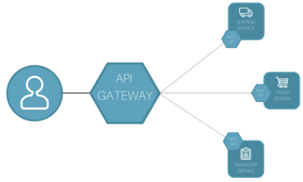

[API Gateway]

API Gateway에 대한 더욱 자세한 내용은 [여기](https://docs.aws.amazon.com/ko_kr/apigateway/latest/developerguide/welcome.html)에서 확인할 수 있습니다.

### AWS Step Functions

Step Functions는 시각적인 워크플로를 사용해 마이크로 서비스를 조정할 수 있고 애플리케이션 기능을 단계별로 실행할 수 있게 합니다. 각 단계를 자동으로 트리거하고 추적하며 오류 발생시 재시도하여 애플리케이션이 의도한대로 작동하도록 돕습니다.

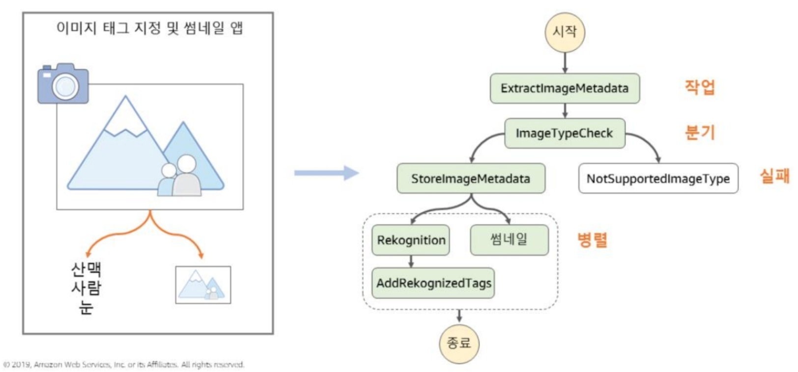

[Step Functions로 상태를 체크하여 각 단계별 Lambda 함수를 실행하는 애플리케이션 구축]

Step Functions에 대한 더욱 자세한 내용은 [여기](https://docs.aws.amazon.com/ko_kr/step-functions/latest/dg/welcome.html)에서 확인할 수 있습니다.

## 마치며

AWS의 기본적 서비스들을 간략하게나마 둘러보았습니다. 교육 내용을 정리한 자료를 바탕으로 작성하였으나, 설명이 부족하거나 부정확할 수 있다고 느껴지는 내용은 모두 [AWS의 Documentation](https://docs.aws.amazon.com/)을 참고하여 올바르고 정확한 정보를 전달하고자 노력했습니다. 긴 글 읽어주셔서 감사합니다.

AWS는 클라우드 서비스 중  규모 및 시장 점유율 1위를 달리고 있습니다. AWS의 기능은 시간이 지날 수록 점점 많아지고 있습니다. 또한 AWS의 영향력은 지속적으로 전세계로 확장되고 있습니다. 지원되는 리전과 가용영역은 지속적으로 많아지고 있습니다. AWS 뿐만 아니라 Azure, GCP 등 클라우드 서비스의 시장 규모와 영향력은 날이 갈수록 커져가고 있습니다.

또한 현대와 같은 빠르게 급변하는 시장에서, 서비스 제공자는 고객의 요구사항을 빠르게 파악하고 양질의 컨텐츠를 신속히 제공하여야 합니다. AWS와 같은 Cloud 서비스를 활용해 시간이 많이 걸리는 작업과 지속적 관리가 필요한 인프라 관리와 같은 부분을 위탁하여 처리하고, 정말로 필요하고 중요한 비즈니스로직에 대해 집중하는 것이 살아남을 가능성을 조금이라도 더 높여준다고 생각합니다. 즉 클라우드를 잘 다루는 서비스 제공자가 성공할 수 있다고 생각합니다.

Docs와 자료를 백번을 읽는 것만큼 실제 인프라를 한번 구축해 보는 것 또한 중요합니다. IT 기술을 배우는 것은 자전거를 배우는 것과 같이 몸으로 익히는 과정은 필수적이라고 생각합니다. "자전거 타는 법"에 대해서 백번을 공부해도, 실제로 자전거를 타지 않는 이상 올바르게 자전거를 탈 수 없습니다.
"기술"이기 때문에 실제 부딪히며 알아가는 것이 훨씬 익히는 데에 도움이 됩니다.  지식이 베이스가 된다면 배우는 것이 더욱 빠르고, 배움의 깊이가 달라지는 것은 당연한 사실입니다.  
덧붙여, 다른 누군가가 제공하는 서비스 예시 인프라를 구축하는 연습을 하기보다, 자신이 현재 운영하고자 하는 서비스 또는 자신이 구축한 서비스를 실제 인프라 구축하여 배포해보는 연습을 하는 것을 권장합니다. 실제 배포상황에서는 주어지는 예시와 같이 편하고 쉽게 작업을 완료하기보다는 더 많은 난관과 노력이 필요한 경우가 대다수이며, 이를 통해 더 많은 실력 향상을 가져올 수 있을 것이라고 기대합니다.
