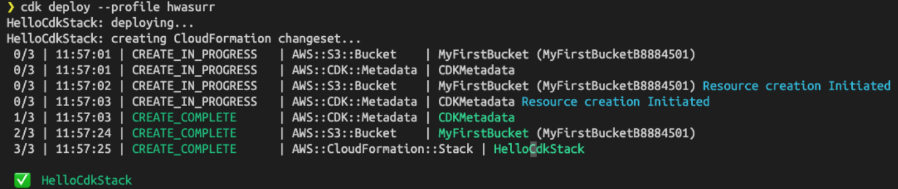

## 개념

- **IaC(Infrastructure as Code)**
물리적 하드웨어 구성이나 인터페이스 구성 도구가 아닌 기계가 읽을 수 잇는 정의 파일들을 통한 컴퓨터 데이터 센터 관리 및 프로비저닝 과정이다.

- **AWS CDK(Cloud Development Kit)**
AWS CDK는 클라우드 인프라를 코드로 정의하고 프로비저닝하는 소프트웨어 개발 프레임워크이다. 주요 AWS 서비스와 통합되어 AWS 리소스를 정의하는 고 수준의 객체 지향 추상화를 제공한다.  
기존에 익숙한 프로그래밍 언어로 AWS 인프라를 예측 가능하고 효율적인 방식으로 정의, 제어 할 수 있어 개발 경험을 개선할 수 있다.

## AWS 리소스를 제어하는 방법

AWS 리소스를 생성 또는 제어하는 방법은 여러가지가 있다.

- **AWS Management Console (GUI)**
- **AWS CLI**
- **AWS CloudFormation**
- **AWS CDK**

먼저 가장 쉽게 접근할 수 있는 방법으로는 AWS Management Console이다. GUI 에서 선택 사항들을 클릭 클릭하며 리소스를 생성할 수 있다. 접근이 쉽기 때문에 처음 AWS를 접하는 사용자들도 AWS를 제어할 수 있다. 하지만, 서비스가 점점 성장하고, 관리하고 설정할 인프라가 늘어남에 따라 GUI로 하나하나 만들어 가는 작업은 고된 노동이 될 수 밖에 없다.

다른 방법으로는 AWS 에서 제공하는 CLI를 사용해 인프라를 구축, 제어하는 것이다. 명령어를 모아 자동화 할 수 있다는 장점이 있다. GUI를 통해 작업을 진행하는 것보다 접근이 어렵다. CLI를 사용하는 해당 방법은 대개 인프라 관리 도구(Terraform, etc) 가 자동화 한 상태의 서비스에서 쓰인다. 물론 개인 사용자도 CLI로 AWS 리소스에 접근하고 관리할 수 있다.

CloudFormation은 클라우드 환경에서 AWS 리소스를 모델링하고 프로비저닝할 수 있도록 정해진 템플릿 문법에 따르는 JSON 또는 YAML 파일을 사용해 인프라를 구축하고 제어하는 작업을 자동화할 수 있도록 도와준다. 각 property가 의미하는 바를 공부해야 하는 단점이 있다.

AWS CDK는 CloudFormation을 친숙한 프로그래밍 언어 단에서 정의하고 사용할 수 있게 도와준다. Typescript, Python, Java, C#(.NET)을 사용하여 정의할 수 있다. AWS 리소스를 제품 개발에 사용하는 프로그래밍 언어를 이용해 모델링하고, 프로비저닝한다. CDK를 한 마디로 얘기하면, 컴파일러의 역할이다. 컴파일 시, CloudFormation 템플릿이 되고, CloudFormation 프로비저닝 엔진은 이 템플릿을 처리하여 AWS 계정에 배포한다.

## Why CDK?

CDK는 프로그래밍 언어 계층에서 접근할 수 있으므로 사용 편의성과 생산성이 극대화된다.

- 코드 인라인 설명, 리팩토링 도구, 코드 탐색 및 단위 테스트 같은 기존 IDE 기능들 역시 모두 동일하게 작동하므로 관리 및 개발이 더 수월해진다.
- 기존에 사용하던 형상 관리 툴을 그대로 사용하면 되니, 버전을 관리하기도 편리하다. 동시에, 함께 개발하는 팀원과 쉽게 공유할 수 있다.
- 반복, 분기 등 프로그래밍 언어가 가지는 특성을 그대로 인프라 구성 설정에 반영할 수 있다.
- 익숙한 코드로 AWS 인프라를 구성할 수 있기 때문에 코드를 읽으면 인프라가 어떻게, 어떤 방식으로 구성되어 있는지 확인할 수도 있다.
- 인프라 설정 코드 옆에 주석을 달아 두는 것도, 문서화를 도울 수 있는 유용한 재료가 될 수 있을 것이다.
- VSCode 사용자의 경우, 인프라의 스택, 리소스 및 정책 등의 정보를 편하게 볼 수 있도록 하는 "AWS Toolkit" 확장 프로그램을 제공한다.

## CDK 튜토리얼

### CDK 준비하기

#### AWS CDK를 설치

```bash
# using npm
npm instaall -g aws-cdk
# using yarn
yarn global add aws-cdk

# 설치 확인
cdk --version
```

#### 환경변수 사용하기

stack에 env 프로퍼티에 region과 account를 명시하면, 해당 stack을 배포하는 과정에서 사용된다. ( AWS팀은 region과 account를 env를 통해 외부로 드러나지 않도록 하기를 권장한다.)

```tsx
new MyStack(app, 'MyStack', {
    env: {
        region: 'REGION',
        account: 'ACCOUNT'
    }
})
```

#### 여러 환경에 따라 여러 스택 구현

스택은 몇 개든지 만들 수 있다. 각 리전에 맞는 설정을 통해 리전 별로 다른 스택을 배포하는 것도 가능하다.  
동일한 인프라 구성에 env 설정만 변경하여  동일한 인프라를 갖는 개발 환경, 테스트 환경, 프로덕션 환경을 구성할 수 있다.( AWS CDK팀은 하나의 CDK앱에서 프로덕션 스택을 필요에 따라 생성하고 배포 하기를 권장한다.)

```tsx
new MyStack(app, 'Stack-One-W', { env : { account: 'ONE', region: 'us-west-2'}}
new MyStack(app, 'Stack-One-E', { env : { account: 'ONE', region: 'us-east-1'}}
new MyStack(app, 'Stack-Two-W', { env : { account: 'TWO', region: 'us-west-2'}}
new MyStack(app, 'Stack-Two-E', { env : { account: 'TWO', region: 'us-east-1'}}
```

#### 자격 증명과 리전을 명시하기

AWS CDK CLI를 사용하기 위해서는 반드시 자격 증명과 리전을 명시해야 한다. `cdk` 명령의  `--profile` 옵션 에 명시 또는 환경 변수로 설정하는 등의 방법을 통해 리전과 자격 증명을 명시할 수 있다.

- cdk 명령에 `—-profile` 옵션을 통해 명시하기 (리눅스/Mac)

    `~/.aws/config`에 다음과 같이 작성하여 test 유저를 정의한다.

    ```
    [profile test]
    aws_access_key_id=AKIAI44QH8DHBEXAMPLE
    aws_secret_access_key=je7MtGbClwBF/2Zp9Utk/h3yCo8nvbEXAMPLEKEY
    region=us-west-2
    ```

    이후 다음과 같이 cdk 명령에 해당 프로필을 설정할 수 있다.

    ```bash
    cdk deploy --profile test
    ```

- 환경 변수 사용하여 명시하기
    - 액세스 키: `AWS_ACCESS_KEY_ID`
    - 시크릿 액세스 키: `AWS_SECRET_ACCESS_KEY`
    - 기본 리전: `AWS_DEFAULT_REGION`

    ```bash
    # Linux & Mac
    export AWS_DEFAULT_REGION=us-east-2
    # Windows
    set AWS_DEFAULT_REGION=us-east-2
    ```

## 첫 CDK 앱 hello world! 작성하기

CDK를 이용한 애플리케이션을 생성 및 개발하는 순서는 대략 다음과 같다.

1. 애플리케이션 디렉토리 생성
2. 애플리케이션 initialize
3. 애플리케이션 코드 추가
4. 애플리케이션 컴파일
5. 애플리케이션에 정의된 AWS리소스 배포
6. 애플리케이션 테스트
7. 위의 과정 반복

### 앱 디렉토리 생성

```bash
mkdir hello-cdk
cd hello-cdk
```

### cdk 앱을 초기화

```bash
cdk init --language LANGUAGE
```

`cdk init` 명령을 통해 AWS CDK 앱을 초기화할 수 있다.

- `LANGUAGE` 에는 CDK로 제공되는 프로그래밍 언어 중 하나를 명시한다. 명시할 수 있는 언어는 다음과 같다 `csharp`, `typescript`, `javascript`, `python`, `java`
- 뒤에 사용하고자 하는cdk template을 명시할 수 있는데, 대부분의 경우 생략하고 기본 값을 사용한다.

typescript로 앱을 생성한다.

```bash
cdk init --languaate typescript
```

### 앱을 컴파일하기

```bash
# using npm
npm run build
# using yarn
yarn build
```

### 앱의 스택을 목록화 하여 확인하기

cdk로 정의한 스택을 확인하기 위해서는 다음의 명령을 사용하면 된다.

```bash
cdk ls

# 해당 명령의 결과는 다음과 같다
HelloCdkStack
```

### AWS S3 버킷 추가하기

현재는 스택이 비어있기 때문에, 배포될 것이 하나도 없다. 예제로 S3 버킷을 생성을 해 보자. 먼저, `@aws-cdk/aws-s3` 패키지를 설치한다.

```bash
# using npm
npm install @aws-cdk/aws-s3
# using yarn
yarn add @aws-cdk/aws-s3
```

Bucket 클래스로 추상홛 되어 있어, new 연산자로 Bucket 인스턴스를 생성하는 코드로 S3 버킷을 정의할 수 있다.

```tsx
import * as core from '@aws-cdk/core';
import * as s3 from '@aws-cdk/aws-s3';

export class HelloCdkStack extends core.Stack {
    constructor(scope: core.App, id: string, props?: core.StackProps) {
        super(socpe, id, props);

        new s3.Bucket(this, 'MyFirstBucket', {
            versioned: true,
            bucketName: 'someBucketName'
        })

    }
}
```

스택의 scope, id, props를 사용할 수 있다. `MyFirstBucket`은 버킷의 id 이고 S3 버킷의 실제 물리적 이름은 아니다. 해당 id는 배포에서 버킷을 고유하게 식별하는 데 쓰인다. 실제 버킷의 물리적 이름을 설정하기 위해서는 버킷을 정의할 때, bucketName 프로퍼티를 설정하면 된다.

이후 다시 코드를 컴파일한다.

```bash
npm run build
```

### AWS CloudFormation 템플릿으로 합성하기

다음의 명령어로 CDK 코드를 AWS CloudFormation 템플릿으로 합성할 수 있다.

```bash
cdk synth
```

해당 명령어를 실행하고 나면, CDK앱을 실행하고, `HelloCdkStack` 스택을 합성한 CloudFormation 템플릿을 보여준다. 해당 명령어의 실행 결과는 다음과 비슷할 것이다.

```bash
Resources:
  MyFirstBucketB8884501:
    Type: AWS::S3::Bucket
    Properties:
      VersioningConfiguration:
        Status: Enabled
    Metadata:
      aws:cdk:path: HelloCdkStack/MyFirstBucket/Resource
  CDKMetadata:
    Type: AWS::CDK::Metadata
    Properties:
      Modules: "@aws-cdk/aws-codepipeline-api=VERSION,@aws-cdk/aws-events=VERSION,@aws-c\
        dk/aws-iam=VERSION,@aws-cdk/aws-kms=VERSION,@aws-cdk/aws-s3=VERSION,@aws-c\
        dk/aws-s3-notifications=VERSION,@aws-cdk/cdk=VERSION,@aws-cdk/cx-api=VERSION\
        .0,hello-cdk=0.1.0"
```

### CDK 앱(인프라) 배포하기

다음 명령으로 스택을 배포할 수 있다.

```bash
cdk deploy
```

이 명령을 실행하면, CDK 코드를 AWS CloudFormation 템플릿으로 합성한 이후, CloudForation을 호출하여 AWS 계정에 배포한다.  코드가 인프라의 보안 상태를 변경하는 경우, 해당 변경되는 정보에 대해 보여주고, 스택이 배포되기 전에 승인을 요청한다.

### 마주한 권한 문제

cdk 에서 정의한 인프라를 생성, 설정하는 모든 과정에 대해서 IAM 계정에 권한이 필요하다. IAM 에서 해당 사용자의 권한을 추가 해주면 된다.

배포 이후 아래의 화면과 비슷한 로그 결과를 얻을 수 있다.



이후 AWS console 에서 s3 대시보드에 들어가 보면, 새로 생성된 버킷을 확인할 수 있다.

### 배포한 CDK app의 resource 삭제하기

단지 테스트를 위해 만든 리소스들의 요금이 과금되는 것을 막기 위해 앱의 리소스를 삭제해야 한다. 삭제는 다음 명령으로 가능하다.

```bash
cdk destroy
```

`y`를 입력하면 해당 스택에 쓰이는 리소스는 모두 자동적으로 삭제한다. 어떤 경우에 명령이 실패할 수도 있는데, 삭제하고자 하는 리소스가 비어 있지 않은 경우이다. 또는 IAM 권한이 없어 실패할 수도 있다. 실패할 수 있는 시나리오는 여럿 있다. [AWS troubleshooting Docs](https://docs.aws.amazon.com/ko_kr/AWSCloudFormation/latest/UserGuide/troubleshooting.html#troubleshooting-errors-delete-stack-fails) 에서 실패에 대한 정보를 확인할 수 있다.

# Reference

[https://docs.aws.amazon.com/cdk/latest/guide/getting_started.html](https://docs.aws.amazon.com/cdk/latest/guide/getting_started.html)

[https://aws.amazon.com/ko/blogs/korea/aws-cdk-developer-preview/](https://aws.amazon.com/ko/blogs/korea/aws-cdk-developer-preview/)

[https://musma.github.io/2019/11/28/about-aws-cdk.html](https://musma.github.io/2019/11/28/about-aws-cdk.html)