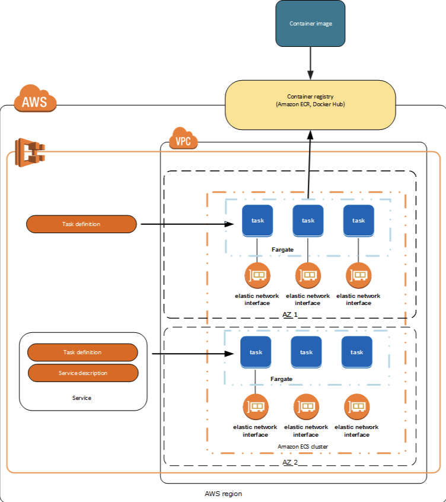
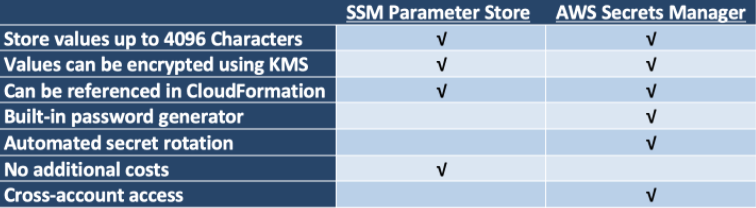

## 배포 스택(Stack)

1. AWS ECS (컨테이너 인스턴스)
2. AWS System Manager (비밀번호, env 데이터 관리)
3. AWS IAM (사용자 aws리소스 권한 관리 - cli 또는 애플리케이션 으로 ecs에 접근 권한을 관리)
4. AWS Route53 (도메인 호스팅)

## AWS ECS (Elastic Container Service)?

AWS ECS는 Cluster에서 Docker container를 손쉽게 실행, 중지 및 관리할 수 있게 해주는 컨테이너 관리 서비스로, 확장성과 속도가 뛰어나다.  
ECS는 두가지의 시작 유형을 가지고 있다. 관리하는 서버를 사용하지 않는 인프라에서 애플리케이션을 호스팅 할 수 있는 **Fargete** 시작 유형 (serverless hosting),  더 세부적인 제어를 위해 관리하는 서버(aws ec2 instance)를 두는 **EC2** 시작 유형 (EC2 instance hosting)이 있다. 필요에 따라 결정하면 된다.

### ECS 사용시 얻을 수 있는 이점

- 간단한 API 호출을 사용하여 컨테이너 기반 애플리케이션을 시작 및 중지할 수 있다.
- 중앙 집중식 서비스를 사용하여 클러스터 상태를 확인할 수  있다
- 다수의 친숙한 EC2 기능에 액세스할 수 있다.
- 일관된 배포 및 구축 환경을 생성하고, 배치 및 ETL(Extract-Transform-Load) 워크로드를 관리 및 크기 조정하고, 마이크로 서비스 모델에 정교한 애플리케이션 아키텍처를 구축할 수 있다.

## ECS의 기능

특정 리전 내 여러 가용 영역에 걸쳐 고 가용성 방식으로 컨테이너를 실행하는 과정을 간소화하는 리전 서비스이다.  
새로운 또는 기존의 VPC(Virtual Private Cloud: 사용자의 AWS 계정 전용 가상 네트워크)에서 ECS 클러스터를 생성할 수 있다.
클러스터를 실행한 후 클러스터 사이에서 실행할 도커 컨테이너 이미지를 지정하는 **작업 정의** 및 **서비스**를 정의할 수 있다. 도커 컨테이너 이미지는 **컨테이너 레지스트리(ECR or Docker Hub)**에 저장 및 pull 된다.


AWS ECS - Fargete시작 유형 환경의 아키텍처

## ECS의 개별 요소(개념)

### 컨테이너(container) 및 이미지(image)

ECS에서 애플리케이션을 배포하려면 애플리케이션 구성 요소가 **컨테이너**에서 실행되도록 구축되어야 한다. 일반적으로 Dockerfile로 빌드 되는 이미지가 이에 해당한다.

### 작업 정의(Task definition)

애플리케이션이 ECS에서 실행되도록 준비하려면 **작업 정의**를 생성한다.

작업 정의는 애플리케이션을 구성하는 하나 이상의 컨테이너를 설명하는 JSON 파일이다. 쉽게 말하면, 작업 정의는 애플리케이션의 청사진이라고 할 수 있다. 작업 정의 JSON 파일에 사용할 컨테이너, 사용할 시작 유형, 개방할 포트, 컨테이너에 사용할 볼륨 등의 다양한 파라미터를 지정한다.

Fargate 시작 유형 + NginX 웹 서버를 실행하는 단일 컨테이너가 포함된 작업 정의의 예제는 다음과 같다.

```json
{
    "family": "webserver",
    "containerDefinitions": [
        {
            "name": "web",
            "image": "nginx",
            "memory": "100",
            "cpu": "99"
        },
    ],
    "requiresCompatibilities": [
        "FARGATE"
    ],
    "networkMode": "awsvpc",
    "memory": "512",
    "cpu": "256",
}
```

### 작업(Task) 및 예약(Scheduling)

작업은 클러스터 내 작업 정의를 인스턴스화하는 것이다. ECS에서 애플리케이션에 대한 작업 정의를 생성 하면 클러스터에서 실행 할 작업 수를 지정할 수 있다. 각 작업은 자체 격리 경계를 포함하여 메모리, CPU, 기본 커널, 네트워크 인터페이스를 다른 작업과 공유하지 않는다.

ECS 작업 스케줄러는 클러스터 내에 작업을 배치하는 일을 한다. 다양한 예약 옵션을 지정할 수 있다.

### 서비스(Service)

ECS 클러스터에서 지정된 수의 작업 정의 인스턴스를 동시에 실행하고 관리할 수 있다. 어떤 이유로 작업이 실패 또는 중지되는 경우 서비스 스케줄러가 작업 정의의 다른 인스턴스를 시작하여 이를 대체하고 사용되는 일정 전략에 따라 원하는 작업 수를 유지한다.

### 클러스터(Cluster)

ECS를 사용하여 작업을 실행하면 Resource의 논리적  그룹인 **클러스터**에 작업을 배치하는 것이다.

Fargate 시작 유형의 경우, ECS에서 클러스터 리소스를 관리한다. (ECS가 관리하는 EC2 인스턴스)
EC2 시작 유형을 사용하면 클러스터는 사용자가 관리하는 컨테이너 인스턴스의 그룹이 된다.

### 컨테이너 에이전트(Container Agent)

컨테이너 에이전트는 ECS 클러스터의 각 인프라 Resource에서 실행된다. Resource에서 현재 실행 중인 작업과 Resource 사용률에 대한 정보를 ECS에 전송하고, ECS로부터 요청을 수신할 때마다 작업을 시작 또는 중지한다.

## Fargate ECS 시작하기 튜토리얼

[Fargate를 사용하여 Amazon ECS 시작하기](https://docs.aws.amazon.com/ko_kr/AmazonECS/latest/developerguide/getting-started-fargate.html)

AWS docs의 ECS 안내서를 참고했다.

 해당 튜토리얼은 Fargate 시작 유형을 사용하는 작업 정의를 생성하여, 작업을 예약하고, ECS 콘솔에 클러스터를 구성하는 과정을 담고 있다.
ECS에서 시작하고자 하는 도커 이미지가 있는 경우 그 이미지로 작업 정의를 만들어서 클러스터에 사용할 수 있을 것이다.

### 사전 조건

EC2 및  ECS 등 AWS 서비스에 액세스 하기 위한 자격 증명을 제공해야 한다. AWS IAM에 사용자를 생성한다.
사용자에게 AdministratorAccess 권한 또는 [Amazon ECS 처음 실행 마법사 권한](https://docs.aws.amazon.com/ko_kr/AmazonECS/latest/developerguide/security_iam_id-based-policy-examples.html#first-run-permissions) 이  있는지 확인한다.

### 1단계: 작업 정의 생성

작업 정의는 애플리케이션에 대한 청사진과 같다. ECS에서 작업을 시작할 때마다 **작업 정의**를 지정해야 한다. 그래야만 컨테이너에 사용할 도커 이미지, 작업에서 사용할 컨테이너 수, 각 컨테이너의 리소스 할당을 ECS에서 알 수 있다.

- **컨테이너 정의 파라미터를 구성**한다.  
    **이름**
      - `name`: **문자열**, **필수**, 최대 255자의 문자,숫자,하이픈,및줄

    **이미지**
      - `image`: **문자열**, **필수**, 컨테이너를 시작할 때 사용되는 이미지. Docker Hub 에 업로드된 이미지는 기본적으로 사용가능하다.  
        새 작업이 시작될 때, ECS 컨테이너 에이전트가 컨테이너에서 사용할 지정 이미지와 태그의 최신 버전을 가져온다. (이때, 이미 실행 중인 작업은 이미지 업데이트가 반영되진 않음.)

    **메모리**  
    컨테이너의 메모리의 양을 제한하는 방법에 **하드 제한**과 **소프트 제한**이 있다.
      - `memory`:  **정수**, **필수아님**, 하드 제한 할 컨테이너의 메모리 양(MiB).
      하드 제한으로 메모리 양을 제한한 경우, 지정한 메모리를 초과 하면 컨테이너가 중지된다.
      - `memoryReservation`: **정수**, **필수아님**, 소프트 제한할 컨테이너의 메모리 양(MiB).
      소프트 제한으로 메모리 양을 제한한 경우, 지정한 메모리를 초과 하면
      (1)지정한 하드 제한
      (2)컨테이너 인스턴스(컨테이너가 실제 돌아가는 ec2 instance)의 모든 가용 메모리 양 까지 요청한다.

    예를 들어 컨테이너가 통상적으로 128MiB의 메모리를 사용하지만 경우에 따라 잠깐 동안 사용량이 256MiB까지 급증하는 경우 memoryReservation을 128MiB로 설정하고 memory 하드 제한을 300MiB로 설정할 수 있다.

    **포트 매핑**
      - `portMappings`: **객체 배열**, **필수아님**, 컨테이너가 호스트 컨테이너 인스턴스의 포트에 액세스하여 트래픽을 송수신 하도록 허용한다.
      `awsvpc` 네트워크 모드를 사용하는 작업 정의의 경우 `containerPort`만 지정해야 한다. `hostPort` 는 빈 칸으로 두거나, `containerPort`와 같은 값이어야 한다.
      이는 `docker run` 의 `-p` 옵션에 매핑된다.
      - `containerPort`: **정수**, **portMappings 사용시 필수**, host 포트에 바인딩되는 컨테이너 포트 번호.
      Fargate 시작 유형으로 작업의 컨테이너를 사용하는 경우 containerPort를 사용해 노출된 포트를 지정 해야 한다.
      - `protocol`: **문자열**, **필수아님**, 포트 매핑에 사용되는 프로토콜 ( `tcp` | `udp` ), 기본값은 tcp이다.

- **작업 정의 파라미터를 정의**한다.  
    **패밀리**
      - `family`: **문자열**, **필수**, 작업 정의의 이름으로, 버저닝이 되는 이름. 특정 패밀리에 등록된 첫번째 작업정의는 번호 1이 부여, 그 이후부터는 순차적으로 번호가 부여된다.

    **작업 역할**
      - `taskRoleArn`: **문자열**, **필수아님**, 작업 정의에서 허용하는 IAM 역할을 명시

    **네트워크 모드**
      - `networkMode`: **문자열**, **필수아님**, 작업의 컨테이너에 사용할 도커 네트워킹 모드. 유효값은 `none`, `bridge`, `awsvpc`, `host` 이다.  
        - `none`의 경우, 컨테이너가 외부 네트워크와 연결되지 않는다.  
        - `bridge`의 경우, 작업이 각 컨테이너 인스턴스에서 실행되는 도커 기본 가상 네트워크를 이용한다. (기본값)  
        - `host`인 경우, 컨테이너 포트를 EC2인스턴스 네트워크 인터페이스에 직접 매핑한다.  
        - `Fargate`시작 유형을 사용하는 경우 awsvpc 네트워크 모드가 필요하다.  

### 2단계: 서비스 구성

작업 정의에서 생성되는 ECS 서비스를 어떻게 구성할 지 선택한다. "서비스"는 클러스터에서 지정된 수의 작업 정의 사본을 시작하고 유지한다.

- **서비스 정의**
  - 서비스 이름: 서비스의 이름을 설정한다. 컨테이너명-service의 형태가 알아보기 쉽다.
  - 원하는 작업 개수: 지정한 작업 정의를 사용하여 시작할 작업의 수를 입력한다.
  - 보안 그룹: 인바운드트래픽을 허용할 IPv4 주소의 범위를 지정한다.
  - (선택사항)로드밸런서 설정: ELB-ALB 로드 밸런서를 사용하도록 설정할 수 있다.  해당 구성을 한 이후, 작업이 시작되면 작업이 로드 밸런서에 등록되고 로드 밸런서의 트래픽은 로드 밸런서에 있는 인스턴스에 분산된다.

### 3단계: 클러스터 구성

Fargate의 경우, 클러스터 인프라가 AWS에 의해서 완전하게 관리되기 때문에, 클러스터 이름을 지정하면 ECS가 네트워킹 및 IAM 구성을 자동으로 처리한다.

- 클러스터 이름: 리전 별로 고유한 문자열. 클러스터의 이름을 설정한다.

### 4단계: 검토

위에서 설정한 사항들을 검토한 다음 Create를 클릭하여 ECS를 그대로 생성하도록 한다. 그러면 AWS에서 서비스에 사용할 리소스를 생성한다.

### 5단계: 서비스 보기

서비스가 웹 기반 애플리케이션인 경우 웹 브라우저로 해당 컨테이너를 볼 수 있다.

1. 서비스 페이지에서 [작업] 탭을 선택한다.
2. 작업 목록에서 작업을 선택한다
3. [Network] 섹션에서 퍼블릭 IP 주소를 확인한다.
4. 웹 브라우저에 퍼블릭 IP 주소를 입력하면 ECS애플리케이션이 표시되는 웹페이지가 보인다.

---

## Route53 + ECS + ALB 도메인 연결하기

1. 배포할 도메인 준비
2. 로드밸런서 및 대상 그룹 생성
3. 로드밸런서를 Route53 호스팅 영역 → A레코드로 등록 (별칭 → 로드밸런서 선택)
4. ECS "Service" 생성 시, 로드밸런서로 해당 ALB를 선택하여 연결
5. 로드밸런서 리스너 ⇒ 원하는 상황에 컨테이너 포트로 보내주는 리스너 규칙 생성
6. CI/CD 툴로 ECS에 자동 배포하도록 설정 (github actions or travis or etc)

## AWS System Manager: Parameter Store 또는 AWS Secrets Manager

보안을 위해 가려야 하는 데이터가 있을 수 있다. 예를 들면 API KEY, DB Config 등이 있을 수 있다. 대개 환경 변수로 설정하여 애플리케이션에서 환경 변수로 접근하는 방식으로 보안적 처리를 한다. ECS를 사용하는 경우에 이와 같은 설정을 하고자 한다면 어떻게 해야 할까?

아래의 페이지는 ECS 작업 컨테이너에 보안이 필요한 정보를 AWS System Manager: Parameter Store 또는 AWS Secret Manager를 통해 컨테이너에 안전하게 전달하는 방법을 설명한다.

[보안 또는 민감한 데이터를 Amazon ECS 작업의 컨테이너에 안전하게 전달](https://aws.amazon.com/ko/premiumsupport/knowledge-center/ecs-data-security-container-task/)

### AWS SSM: Parameter Store VS. AWS Secrets Manager

1. System Manager: Parameter Store
    - Managed Key-Value 저장소 서비스
    - AWS KMS(Key Management Service)로 암호화 할 수 있고, IAM을 통해 권한을 제한 한다
    - 싸다 ( key-value 1000 요청 당 0.05USD, 고급 파라미터는 개당 0.05USD)
2. Secrets Manager
    - Managed Key-Value 저장소 서비스
    - AWS KMS(Key Management Service)로 암호화 할 수 있고, IAM을 통해 권한을 제한 한다
    - 임의의 비밀번호를 생성할 수 있다.
    - key순환 통합을 지원 하므로, 비밀정보를 동적으로 변경할 수 있다.
    - 비싸다 ( key-value 하나당 0.4USD, 10000 요청 당 0.05USD)
    - 여러 계정으로 Access 가능



SSM Parameter Store, Secrets Manager 둘 모두, IAM 역할을 설정 한 뒤에 작업 정의 과정에서 ECS 컨테이너에 환경 변수로 데이터를 전달할 수 있다.