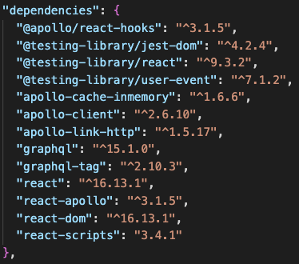

## What is GraphQL?

- Facebook에 의해 개발되고, 오픈소스로 풀린 어플리케이션 레벨 Query Language 입니다.
- 타입 시스템을 통해 쿼리를 실행하는 서버사이드 런타임으로, 특정 데이터베이스나 스토리지에 종속되지 않습니다. 따라서 어떤 데이터베이스와도 함께 사용 가능합니다. (MySQL, postgreSQL, MongoDB, third party API, ...)
- 정말로 원하는 데이터만 요청할 수 있습니다. (Under-fetching, Over-fetching 을 예방합니다.)
- 1번의 요청으로 여러 리소스에 대한 정보를 받아 올 수 있습니다.

## Examples

- 단순 쿼리

  - GraphQL Query

  ```graphql
  {
  	user(id: "100") {
  		name,
  		email
  }
  ```

  - The result data

  ```json
  {
  	"user": {
  		"id": "100",
  		"name": "John Doe",
  		"email": "john@gamil.com"
  }
  ```

- 여러 리소스 반환 쿼리

  - GraphQL Query

  ```graphql
  {
  	user(id: "100") {
  		name,
  		email,
  		posts {
  			title
  		}
  }
  ```

  - The result data

  ```json
  {
  	"user": {
  		"id": "100",
  		"name": "John Doe",
  		"email": "john@gamil.com",
  		"posts": [
  			{"title": "Post 1"},
  			{"title": "Post 2"}
  		]
  }
  ```

### GraphiQL

브라우저 상에서 동작하는 GraphQL 러너 GUI. Highlighting, Error reporting, Hinting 등의 기능을 제공합니다.

### Supported Langauges

- C## / .NET, Clojure, GO, JAVA, Javascript, PHP, Python, Scala, Ruby 등 여러 많은 언어를 지원합니다.

---

## 예제. express + grahpql + react + react-apollo

아래에는 axios로 json-server 와 REST 통신하는 express + graphql 서버를 만들고, react에서 express+graphql 서버로 CRUD 작업을 요청하여 데이터를 교환하는 과정을 담았습니다.

json-server에 React 단에서 곧바로 요청을 하면 되지 않느냐? 하는 의문이 있을 수 있습니다. 쉽게 예제를 이해하기 위한 구조라고 생각해 주시기 바랍니다. 위에서 언급 한대로, GraphQL은 json-server 와 같은 데이터 서버를 사용할 수도 있고 mysql, mongodb(mongoose), 등 RDB, NoSQL, 어떤 데이터베이스와도 함께 사용할 수 있습니다.

### Installation

먼저, 폴더를 하나 생성하고, `yarn init` 을 통해 package.json을 생성합니다.

```bash
mkdir example-express-graphql
yarn init
```

이후, 사용될 dependencies를 추가합니다.

```bash
yarn add graphql express express-graphql json-server axios
yarn add nodemon --dev
```

작업 진행 이후, package.json은 다음과 같을 것입니다.

- `/package.json`

```json
{
  "name": "example-express-graphql",
  "version": "1.0.0",
  "main": "index.js",
  "license": "MIT",
  "scripts": {
    "dev:server": "nodemon index.js",
    "json:server": "json-server --watch data.json",
    "react:server": "cd client && PORT=3001 yarn start"
  },
  "dependencies": {
    "axios": "^0.19.2",
    "express": "^4.17.1",
    "express-graphql": "^0.9.0",
    "graphql": "^15.1.0",
    "json-server": "^0.16.1"
  },
  "devDependencies": {
    "nodemon": "^2.0.4"
  }
}
```

### 먼저, Json-server 생성

먼저, 이번 예제에서 json-server의 데이터베이스로 사용 될 json 파일을 생성합니다.

- `/data.json`

```json
{
  "customers": [
    {
      "id": "1",
      "name": "Dan",
      "email": "dan@gmail.com",
      "age": 15
    },
    {
      "id": "2",
      "name": "Simon",
      "email": "simon@gmail.com",
      "age": 25
    },
    {
      "id": "3",
      "name": "Mbaku",
      "email": "baku@gmail.com",
      "age": 27
    }
  ]
}
```

package.json에서 `yarn json:server` 스크립트를 작성 하였으므로, 해당 명령어로 json 서버를 실행할 수 있습니다. json-server는 기본적으로 3000 port를 listen합니다. 따라서 json-server의 로컬 환경 호스트 명은 `[http://localhost:3000`과](http://localhost:3000과) 같을 것입니다.

### Express + GraphQL 서버 생성

이제, graphQL을 통해 json-server와 통신하는 express 서버를 생성할 차례입니다. 먼저 예제의 root 폴더에 index.js 파일을 생성하고, 간단한 express 서버를 생성합니다.

- `/index.js`

```jsx
const express = require('express');
const cors = require('cors');
const expressGraphQL = require('express-graphql');
const schema = require('./schema.js');

const app = express();
const port = 4000;

// For Cross origin resource sharing
app.use(cors());

app.use('/graphql', expressGraphQL({
	schema: schema,
	graphiql: true
})

app.listen(port, () => {
	console.log(`listening on ${port}`);
})
```

GraphQL의 타입 및 데이터에 대한 표현 정보를 담고 있는 schema를 만들기 위해 schema.js 파일을 생성합니다. 먼저 graphql이 다룰 데이터가 어떤 것이고, 어떻게 생겨먹은 놈인지를 알려야 합니다.
위의 `data.json` 에서 정의했 듯, 우리는 `Customer` 라는 객체를 가지고 있고 해당 객체에는 `id`, `name`, `email`, `age` 필드가 존재합니다. 이 객체에 대한 정보를 `graphql`의 `GraphQLObjectType` 생성자로 생성할 수 있습니다.
id와 name과 email 값은 문자열이므로, 해당 필드에 대해 `type: GraphQLString` 로 설정해 줍니다
age 값은 숫자이므로, `type: GraphQLInt`로 설정해 줍니다.

- `/schema.js`

```jsx
const { GraphQLObjectType, GraphQLString, GraphQLInt } = require("graphql");

// CustomerType
const CustomerType = new GraphQLObjectType({
  name: "Customer",
  fields: () => ({
    id: { type: GraphQLString },
    name: { type: GraphQLString },
    email: { type: GraphQLString },
    age: { type: GraphQLInt },
  }),
});
```

이제 `Customer` 에 대한 타입정의는 끝났습니다. 이제 GraphQL이 해당 타입의 데이터를 불러오고, 추가하고, 삭제하고, 변경할 수 있도록 `Query`와 `Mutation` 이라는 이름을 가진 타입을 정의해야 합니다. `Query` 는 read, HTTP 메소드로는 get에 해당한다고 볼 수 있습니다. read를 제외한 나머지 create, update, delete 요청을 `Mutation`이 담당합니다. 먼저 Query 부터 시작하겠습니다.

`GraphQLObjectType` 생성자로 생성하고 이름을 `RootQuery` 라고 명명합니다. `RootQuery`쿼리는 필드로 `customer`, `customers`를 갖습니다. `customer`는 `CustomerType`임을 명시하고, 해당 `GraphQL`쿼리 요청이 들어온 경우 실행 될 `resolve` 함수와 그 함수로 전달 될 `args`를 정의합니다. `customers`는 `CustomerType`의 리스트 형태이므로 `GraphQLList` 타입으로 설정하고, `resolve` 함수를 정의합니다.

우리는 json-server와 통신하여 데이터를 가져올 것이므로, `axios`를 사용하여 json-server에 요청합니다. 개별 customer의 정보를 얻기 위해서 args로 특정 id값을 전달하고, 그 id값에 해당하는 customer 정보를 반환합니다. 여러 customer의 정보를 얻기 위해서 json-server의 `/customers` 엔드포인트로 요청하여 얻은 정보를 반환합니다.

- `/schema.js`

```jsx
const axios = require("axios");
const {
  GraphQLObjectType,
  GraphQLString,
  GraphQLInt,
  GraphQLSchema,
  GraphQLList,
} = require("graphql");

// CustomerType
const CustomerType = new GraphQLObjectType({
  name: "Customer",
  fields: () => ({
    id: { type: GraphQLString },
    name: { type: GraphQLString },
    email: { type: GraphQLString },
    age: { type: GraphQLInt },
  }),
});

// Root Query
const RootQuery = new GraphQLObjectType({
  name: "RootQueryType",
  fields: {
    customer: {
      type: CustomerType,
      args: {
        id: { type: GraphQLString },
      },
      resolve(parentValue, args) {
        return axios
          .get(`${API_HOSTNAME}/customers/${args.id}`)
          .then((res) => res.data);
        // return customers.find((cus) => cus.id === args.id);
      },
    },
    customers: {
      type: new GraphQLList(CustomerType),
      resolve(parentValue, args) {
        return axios.get(`${API_HOSTNAME}/customers`).then((res) => res.data);
      },
    },
  },
});
```

이제는 새로운 customer의 생성, 기존 customer의 정보 변경, customer의 삭제등을 위해 `Mutation`을 작성할 차례입니다.
GraphQLObjectType 생성자로 mutation 타입을 생성하고, 필드로 `addCustomer`, `deleteCustomer`, `editCustomer` 를 추가합니다. 각 필드마다 데이터 타입을 설정하고, json-server에 post 요청으로 새로운 cusomter를 추가하거나, delete 요청으로 기존의 customer를 삭제하거나, patch 요청으로 기존의 customer의 정보를 수정하는 `resolve`함수를 작성합니다.
`args`로 받을 인자가 필수 값이라면, `GraphQLNonNull` 생성자로 기존의 type을 감싸줍니다.
마지막으로, `GraphQLSchema` 생성자로 grahql 스키마를 생성합니다. 이 스키마에 query로 RootQuery를, mutation 에 mutation 을 넣고, export 합니다.

- `/schema.js`

```jsx
const axios = require('axios');
const {
	GraphQLObjectType,
	GraphQLString,
	GraphQLInt,
	GraphQLSchema,
	GraphQLList,
	GraphQLNonNull,
} = require('graphql');

...

const mutation = new GraphQLObjectType({
  name: 'Mutation',
  fields: {
    addCustomer: {
      type: CustomerType,
      args: {
        name: { type: new GraphQLNonNull(GraphQLString) },
        email: { type: new GraphQLNonNull(GraphQLString) },
        age: { type: new GraphQLNonNull(GraphQLInt) },
      },
      resolve(parentValue, args) {
        // add data
        return axios.post(`${API_HOSTNAME}/customers`, {
          name: args.name,
          email: args.email,
          age: args.age,
        }).then(res => res.data);
      }
    },
    deleteCustomer: {
      type: CustomerType,
      args: {
        id: { type: new GraphQLNonNull(GraphQLString) }
      },
      resolve(parentValue, args) {
        // add data
        return axios.delete(`${API_HOSTNAME}/customers/${args.id}`)
          .then(res => res.data);
      }
    },
    editCustomer: {
      type: CustomerType,
      args: {
        id: { type: new GraphQLNonNull(GraphQLString) },
        name: { type: GraphQLString },
        email: { type: GraphQLString },
        age: { type: GraphQLInt },
      },
      resolve(parentValue, args) {
        // add data
        return axios.patch(`${API_HOSTNAME}/customers/${args.id}`, args)
          .then(res => res.data);
      }
    },
  }
})

module.exports = new GraphQLSchema({
  query: RootQuery,
  mutation
})
```

이제, graphiql로 방금 정의한 RootQuery, Mutation을 실행 해 볼 수 있습니다. 두 개의 터미널을 켜고, 각 실행 스크립트를 통해 json-server와 express-graphql 서버를 실행하고, 브라우저에서 [`http://localhost:4000/graphql`](http://localhost:4000/graphql) 로 접속하여 graphQL을 작성하여 실행해 볼 수 있습니다.

```bash
## 터미널1
## express - graphql 서버
yarn dev:server

## 터미널2
## json-server
yarn json:server
```

- 전체 customer 조회
- 개별 customer 조회
- 신규 customer "elise" 추가
- "elise" customer 정보 변경
- "elise" customer 삭제

### frontend - React 서버 생성

graphiql 에서 테스트를 진행해, express-graphql 서버가 제대로 동작하는 지 알아보았습니다. 이제는 frontend에서 express 서버로 쿼리를 전송하여, 고객 데이터를 받아오거나, mutation 쿼리를 전송하여 고객 데이터를 삭제, 변경, 추가 하는 작업을 진행하고자 합니다. 먼저, root 폴더 내 client라는 폴더로, create-react-app을 통해 react 프로젝트를 생성합니다.

```bash
npx create-react-app client && cd client
```

react 프로젝트를 생성한 뒤, 사용할 dependencies를 설치합니다.

### Installation

```bash
yarn add @apollo/react-hooks graphql-tag apollo-client apollo-cache-inmemory apollo-link-http graphql react-apollo
```

react hook으로 GraphQL쿼리를 관리하기 위한 `@apollo/react-hooks`, graphql의 자바스크립트 구현체 `graphql`, GraphQL 쿼리 파싱 템플릿 리터럴 태그 `graphql-tag`, Apollo 에서 제공하는 graphQL 관련 라이브러리 `apollo-client`, `apollo-cache-inmemory`, `apollo-link-http` 등을 설치합니다. package.json의 dependencies 목록은 다음과 같을 것입니다.



설치 이후, `src/index.js` 파일에서, ApolloClient를 생성하고 ApolloProvider 컴포넌트를 App 컴포넌트 위에 래핑해 줍니다.

```jsx
import React from "react";
import ReactDOM from "react-dom";
import "./index.css";
import App from "./App";
import * as serviceWorker from "./serviceWorker";

import ApolloClient from "apollo-client";
import { InMemoryCache } from "apollo-cache-inmemory";
import { createHttpLink } from "apollo-link-http";
import { ApolloProvider } from "react-apollo";

const client = new ApolloClient({
  link: createHttpLink({ uri: "http://localhost:4000/graphql" }),
  cache: new InMemoryCache(),
});

ReactDOM.render(
  <React.StrictMode>
    <ApolloProvider client={client}>
      <App />
    </ApolloProvider>
  </React.StrictMode>,
  document.getElementById("root")
);

serviceWorker.unregister();
```

이후 `src/App.js` 에서 graphQL서버로부터 데이터를 받아오고, 받아온 데이터를 UI로 보여 줄 컴포넌트를 생성합니다. graphql-tag로 mutation, query를 작성하고, `@apollo/react-hooks` 의 useQuery, useMutation 훅을 이용해 graphql 서버로부터 데이터를 받아오거나 추가, 변경, 삭제합니다. `$`표시가 앞에 붙은 변수는 Query 또는 Mutation 함수의 variables 인자로 넣어 동적으로 할당될 수 있습니다.

variables에 들어가는 값들을 모두 하드코딩하였으나, 해당 값을 동적으로 설정한다면, "elise" 뿐만이 아닌 특정 유저에 대해 변경, 삭제, 추가가 가능합니다.

그리고 useQuery와 비슷하게, useMutation 훅의 리턴값 튜플의 두번째 값은 data, loading, error 등의 필드를 갖는 객체입니다. 해당 객체를 통해 mutation이 올바르게 진행되었는 지, 로딩중인지 등의 정보에 접근할 수 있습니다.

```js
import React from "react";
import { useQuery, useMutation } from "@apollo/react-hooks";
import gql from "graphql-tag";

const CUSTOMER_SELECT_QUERY = gql`
  query {
    customers {
      id
      name
      email
      age
    }
  }
`;
const CUSTOMER_ADD_MUTATION = gql`
  mutation AddCustomer($name: String!, $email: String!, $age: Int!) {
    addCustomer(name: $name, email: $email, age: $age) {
      id
      name
      email
      age
    }
  }
`;
const CUSTOMER_EDIT_MUTATION = gql`
  mutation EditCustomer(
    $id: String!
    $name: String
    $email: String
    $age: Int
  ) {
    editCustomer(id: $id, name: $name, email: $email, age: $age) {
      id
      name
      email
      age
    }
  }
`;
const CUSTOMER_DELETE_MUTATION = gql`
  mutation DeleteCustomer($id: String!) {
    deleteCustomer(id: $id) {
      id
    }
  }
`;

function Button(props) {
  const { handleClick, children } = props;
  return (
    <button
      style={{ height: 50 }}
      type="button"
      onClick={() => {
        handleClick();
      }}
    >
      {children}
    </button>
  );
}

function App() {
  const { loading, error, data, refetch } = useQuery(CUSTOMER_SELECT_QUERY);
  const [addCustomer] = useMutation(CUSTOMER_ADD_MUTATION);
  const [editCustomer] = useMutation(CUSTOMER_EDIT_MUTATION);
  const [deleteCustomer] = useMutation(CUSTOMER_DELETE_MUTATION);

  return (
    <div
      style={{
        display: "flex",
        flexDirection: "column",
        alignItems: "center",
        justifyContent: "center",
      }}
    >
      <section>
        <h1>Example-Express-GraphQL</h1>
      </section>
      <section>
        <Button
          handleClick={() => {
            refetch();
          }}
        >
          고객 데이터 요청
        </Button>
        <Button
          handleClick={() => {
            addCustomer({
              variables: {
                name: "elise",
                email: "elise@gmail.com",
                age: 24,
              },
            });
            refetch();
          }}
        >
          고객 데이터 생성
        </Button>
        <Button
          handleClick={() => {
            const elise = data.customers.find((c) => c.name === "elise2");
            if (elise) {
              editCustomer({
                variables: {
                  id: elise.id,
                  name: "elise2",
                },
              });
              refetch();
            }
          }}
        >
          고객 데이터 변경
        </Button>
        <Button
          handleClick={() => {
            const elise = data.customers.find((c) => c.name === "elise2");
            if (elise) {
              deleteCustomer({
                variables: {
                  id: elise.id,
                },
              });
              refetch();
            }
          }}
        >
          고객 데이터 삭제
        </Button>
      </section>

      {loading && "Loading..."}
      {!loading && error && <section>error occured!</section>}
      {!loading && !error && data && (
        <section>
          {data.customers.map((customer) => (
            <ul key={customer.id} style={{ backgroundColor: "#ddd" }}>
              <li>{customer.id}</li>
              <li>{customer.name}</li>
              <li>{customer.age}</li>
              <li>{customer.email}</li>
            </ul>
          ))}
        </section>
      )}
    </div>
  );
}

export default App;
```

여기까지, React 앱에서 Express 서버로 Apollo의 도움을 받아 graphQL로 요청하고, Express 서버에서는 전달받은 쿼리에 따라 사전에 정의해 둔 type과 resolver를 이용해 쿼리를 처리하는 간단한 예제를 만들며 graphql을 js 생태계에서 어떻게 사용할 지에 대해 알아봤습니다.

이번 포스팅을 위해, 줄곧 관심만 가지고 있었던 GraphQL을 어떻게 실제로 적용할 수 있는지에 대해 알아보는 시간을 가졌습니다. 역시, 백번 듣는 것보다 한번 보는 것이 낫고 백번 보는 것보다 한번 경험해 보는 것이 나은 것 같습니다. 경험하기 이전까지는 막연하게 생각하기를, API 패러다임과 관련한 새로운 기술이며, 원하는 데이터를 특정하여 가져올 수 있다는 정도만 어렴풋이 알고 있었습니다. 간단한 예제를 작성해 봤지만, 느낀 것이 많습니다.

backend-frontend 간의 협업 프로세스가 기존과는 다른 방식으로 변경될 수 있다고 느꼈습니다. frontend에서 사용하고자 하는 리소스, 필드를 특정하여 요청할 수 있으므로 기존 backend에서의 일이 frontend 로 조금은 옮겨진 느낌이 있습니다.
저는 이것이 frontend에서의 작업을 더 힘들게 만들지는 않는다고 느꼈습니다. 기존에 API 명세 또는 backend 코드를 살피거나, backend 개발자에게 새로운 엔드포인트를 요청했던 것과는 다르게, 현재 필요한 데이터를 컴포넌트 단에서 곧바로 정의하여 요청할 수 있어 편하고 유용하게 느껴졌습니다.
또한, backend에서의 GraphQL의 보일러 플레이트(resolver, typedefs, ...)가 모듈화에 더욱 도움을 주는 듯한 느낌을 받았습니다.

몇 가지 더욱 알아 볼 필요가 있다고 생각한 것은, auth와 orm, typescript와 관련한 부분이었습니다.

graphql은 하나의 엔드포인트를 갖기 때문에, express 미들웨어 방식으로 authentication, authorization을 적용하게 되면, 모든 요청에 대해 같은 인증과 인가 로직이 실행될 것으로 생각합니다. token 발행과 같은 인증이 필요없는 요청에 대해서는 인증 및 인가 로직을 제외할 방법이 있는지 궁금한 부분입니다. 생각해 보기로는, 각 resolver 마다 인증 및 인가 로직을 추가하는 방식을 사용할 수는 있을 것 같다고 생각했지만, 다른 더욱 효율적인 방법이 있는 지 역시 더욱 알아보아야 할 듯 합니다.

추가적으로, 조금 알아본 바로는, typegraphql을 사용하면 하나의 클래스에서 DB 모델링과 graphql 타입 정의를 함께 진행할 수 있다고 합니다. ORM에서의 DB모델링과 graphql 타입 정의가 연동이 될 수 있다면 좋겠다는 생각을 했는데, 매우 관심이 갑니다.
