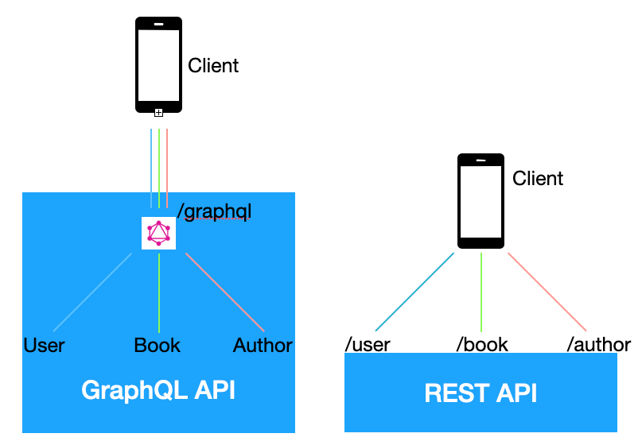

GraphQL은 API에 대한 새로운 패러다임으로 여겨지고 있습니다. GraphQL에서는 API서버에서 엄격하게 정의된 endpoint 들에 요청하는 대신, 한번의 요청으로 정확히 가져오고 싶은 데이터를 가져올 수 있게 도와주는 쿼리를 보낼수 있습니다. 예를 들어, user에 대한 몇 가지의 간단한 데이터가 필요할 때, 필요한 만큼의 user 정보를 최적화하여 가져올 수 있습니다. GraphQL은 Frontend와 Backend의 협업 방식에 많은 변화를 가져올 수 있습니다. Backend에서의 많은 로직을 Frontend로 분산할 수 있습니다.

## What is difference between REST and GraphQL

### 요약하자면 다음과 같습니다.(TL;DR)

- REST에서는 Resource에 대한 형태 정의와 데이터 요청 방법이 연결되어 있지만, GraphQL에서는 Resource에 대한 형태 정의와 데이터 요청이 완전히 분리되어 있습니다.
- REST에서는 Resource의 크기와 형태를 서버에서 결정하지만, GraphQL에서는 Resource에 대한 정보만 정의하고, 필요한 크기와 형태는 client단에서 요청 시 결정합니다.
- REST에서는 URI가 Resource를 나타내고 Method가 작업의 유형을 나타내지만, GraphQL에서는 GraphQL Schema가 Resource를 나타내고 Query, Mutation 타입이 작업의 유형을 나타냅니다.
- REST에서는 여러 Resource에 접근하고자 할 때 여러 번의 요청이 필요하지만, GraphQL에서는 한번의 요청에서 여러 Resource에 접근할 수 있습니다.
- REST에서 각 요청은 해당 엔드포인트에 정의된 핸들링 함수를 호출하여 작업을 처리하지만, GraphQL에서는 요청 받은 각 필드에 대한 resolver를 호출하여 작업을 처리합니다.

### Resources

먼저, REST 방식을 살펴볼까요? REST의 핵심은 Resource입니다. 각각의 리소스는 URL 끝점으로 정의되고, 해당 끝점에 특정 HTTP Method로서 요청하여 데이터를 검색할 수 있습니다. 요즘 대부분의 REST API 서버는 JSON형식으로 데이터를 제공할 것입니다. 다음과 같은 요청에, 다음과 같은 데이터를 결과로 받을 수 있을 것입니다.

- GET `/books/1`

```json
{
	"title": "Romance of the Three Kingdoms",
	"author": {
		"firstName": "Luo",
		"lastName": "Guanzhong"
	}
}
```

(대부분의 REST API에서는 `author`를 다른 리소스로 분리해 둡니다.) 여기서 유념해야 할 점은, 리소스의 타입 또는 형태와 리소스를 가져오는 방식이 연결되어 있다는 것 입니다. /books 라는 리소스를 요청 하면 위의 JSON 파일의 형태의 데이터가 주어지게 됩니다.

위의 books 예시를 GraphQL로 옮겨 볼까요? 일단, `Book`과 `Author`라는 타입을 정의해야 합니다.

```graphql
type Book {
	id: ID
	title: String
	author: Author
}
type Author {
	id: ID
	firstName: String
	lastName: String
	books: [Book]
}
```

여기서 GraphQL 과의 큰 차이점이 드러납니다. GraphQL에서는 리소스의 유형과 리소스를 가져오는 방식이 완전하게 분리되어 있습니다. 우리는 지금 Book과 Author의 형태만을 정의했지, client에서 데이터를 어떻게 요청할 수 있는 지에 대해서는 아무런 정보가 없습니다.

Book과 Author에 접근할 수 있도록, 우리는 `Query`라는 타입이 필요합니다. 다음과 같이 작성될 수 있습니다.

```graphql
type Query {
	book(id: ID!): Book
	author(id: ID!): Author
}
```

이제 우리는 REST와 비슷한 방식으로 요청할 수 있습니다.

- `/graphql?query={ book(id: "1") { title, author { firstName } } }`

```json
{
  "title": "Black Hole Blues",
  "author": {
    "firstName": "Janna",
  }
}
```

REST와는 다르게 /books등과 같이 각 Resource에 대한 엔드포인트가 따로 존재하지 않고, 하나의 엔드포인트만 존재합니다. 또한 해당 엔드포인트로 요청 시, 원하는 리소스와 해당 리소스에서 원하는 필드를 특정하는 GraphQL query를 함께 보냅니다. 위의 gql을 통해, id = 1 인 book의 title과 author의 firstName 만 가져올 수 있었습니다.

### URL Routes vs GraphQL Schema

API는 요청할 수 있는 리소스가 어떤 것이 있고, 어떤 리소스에 어떤 요청을 했을 때 어떠한 결과가 나에게 전달되는 지를 모르면, 당연하게도 아무 쓸모가 없습니다.  모든 API 서비스는 해당 API에 대한 명세가 있습니다. GraphQL에서는 GraphQL introspection이, REST API 에서는 Swagger가 문서화를 쉽게 도와줍니다. 문서화 뿐만 아니라, 실제 요청을 테스트해 볼 수도 있도록 도와줍니다.

```
GET /books/:id
GET /authors/:id
GET /books/:id/comments
POST /books/:id/comments
```

REST API에서 어떤 데이터를 조회하거나 추가하는 것과 같은 작업을 진행하고자 할 때, 제일 먼저 생각해야 하는 것은 어떤 엔드포인트로 요청을 보내야 하는지 입니다. 각 엔드포인트는 해당 리소스를 가리키며, 요청의 HTTP method에 따라 어떤 작업을 진행하는 지 달라집니다.

GraphQL에서는 URL을 Resource를 특정 짓는 것에 사용하지 않습니다. GraphQL Schema가 Resource를 특정 짓습니다. 또한, HTTP Method로 어떤 작업을 진행하게 되는지 구분하지 않고, Query, Mutation이라는 타입을 사용해 구분합니다.

어떻게 보면, 어떤 리소스와 필드를 가져오게 될 지 결정한다는 점에서 REST의 resource목록이 Query와 Mutation 타입에서 나열된 필드와 비슷합니다.

GraphQL은 한번의 요청으로 여러 resource에 대해 접근할 수 있습니다. 반면에 REST API에서 여러 리소스에 접근하고자 한다면 여러 번의 요청은 불가피합니다.

### Route Handlers vs Resolvers

API를 요청하면 API서버에서는 어떻게 될까요? 요청으로부터의 Resource, HTTP Method 에 해당하는 사전에 정의된 로직(DB와의 작업을 진행하거나, 다른 API를 호출하거나, 계산, 분석 등을 진행할 것입니다.)을 실행하고, 결과를 되돌려 주는 것이 일반적입니다. REST와 GraphQL은 대개 모든 언어에서 구현 가능합니다. 그 중 Nodejs 서버를 기준으로 알아보겠습니다.

- REST API

```jsx
app.get('/books/:id', function (req, res) {
	const { id } = req.params;

	// working with DB or call different API, ...

	const result = {
		title: "Romance of the Three Kingdoms",
		author: {
			firstName: "Luo",
			lastName: "Guanzhong"
		}
	};

	res.send(result);
})
```

title과 author 필드를 갖는 json 데이터를 라는 문자열을 응답하는 /books 엔드포인트가 있습니다. /books 엔드포인트는 GET 방식 요청에만 반응합니다. 클라이언트에서 이 서버의 `GET /books/1`로 요청하면 다음 응답을 받을 수 있습니다.

```json
{
	"title": "Romance of the Three Kingdoms",
	"author": {
		"firstName": "Luo",
		"lastName": "Guanzhong"
	}
}
```

- GraphQL API

```jsx
const resolvers = {
	Query: {
		book: (parent, args) => {

			// working with DB or call different API, ...

			const result = {
				title: "Romance of the Three Kingdoms",
			};
			return result;
		},
		author: (parent, args) => ({ firstName: "Luo", lastName: "Guanzhong" })
	}
}
```

REST와는 다르게 특정 엔드포인트에 대한 어떤 함수를 제공하는 대신, Query타입의  `books`와 같은 특정 필드에 해당하는 함수를 제공합니다. GraphQL에서 이런 함수를 resolver 라고 합니다.

클라이언트에서 다음의 쿼리를 통해 요청하여 응답을 받을 수 있습니다.

```graphql
query {
	book(id: "1") {
		title
		author {
			firstName
			lastName
		}
	}
}
```

서버로 요청이 들어오면, 서버는 요청에서 GraphQL Query를 찾습니다. query에 존재하는 field들의 resolver를 호출하고, 각 필드마다 호출된 resolver의 반환 값을 모아 query의 형태와 일치하는 json 데이터를 응답합니다. 이 경우에는 다음의 데이터가 응답될 수 있습니다.

```json
{
	"title": "Romance of the Three Kingdoms",
	"author": {
		"firstName": "Luo",
		"lastName": "Guanzhong"
	}
}
```

간단하게 그림으로 요약하면 다음과 같습니다.



## 마치면서

겉핥기 식으로 겪었을 때는 모든 기술이 멋지고 유용해 보입니다만, 실제 프로덕션에 적용했을 때에는 어떤 예기치 못한 에러와 문제가 발생할 지는 두고 보아야 합니다. graphql이 페이스북에 의해 오픈소스로 공개된 것도 5년이 지났습니다. 개발 부터의 시간을 따지면 8년이 된 기술입니다. 이제는 '신 기술' 이라고 말하기에는 조금은 부적절할 수 있을 것 같습니다. 많은 관련 툴, 라이브러리들이 제작되었고 이제는 REST에 비해 관련 툴과 라이브러리가 적다고 할 수도 없을 정도입니다. 전 세계의 많은 개발자들이 GraphQL에 크게 관심을 가지며 유지, 보수, 개발해 나가고 있습니다. 개발 블로그, stackoverflow 등 커뮤니티에 레퍼런스도 많이 쌓여 가고 있습니다.

REST 역시 오랫동안 사랑 받았으며, 지금도 여전히 유용한 패러다임입니다. 현재 구현된 대부분의 API 서비스가 REST를 따른다고 말 해도 과언이 아닙니다. (과연 정말 RESTful 한지는 열어 봐야 아는 것이겠지만요..) 모두가 사용하고 따르는 기술은 무엇이든 그럴 만한 이유가 있습니다. 사용성이 좋다거나, 호환성이 좋다거나.. 여러 많은 잣대가 포함될 수 있습니다.

오늘 grpahql 과 rest의 차이점에 대해 간략하게나마 알아봤습니다. 둘 중 무엇이 더욱 좋다고는 당연하게도 장담할 수 없습니다. 상황과 환경에 따라 어느 패러다임이 더욱 만족스러운지는 달라지니까요. GraphQL이 더욱 성장한다고 해서 REST가 사라질 것이라고 예상하지 않습니다.

개발할 코드의 양은 많아질 수 있으나, 하나의 엔드포인트는 graphql로 통신하고, 다른 엔드포인트들은 REST API를 제공하여 두 API 서비스를 함께 제공할 수도 있습니다.

## 참고

[https://www.apollographql.com/blog/graphql-vs-rest-5d425123e34b](https://www.apollographql.com/blog/graphql-vs-rest-5d425123e34b)