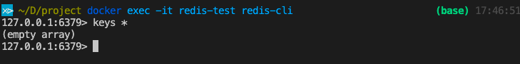
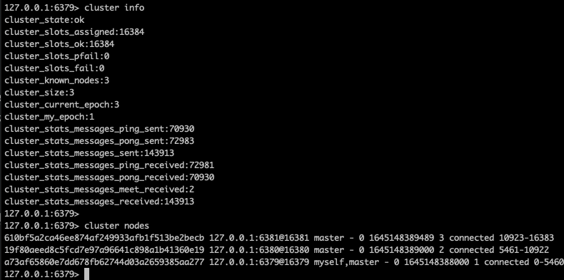
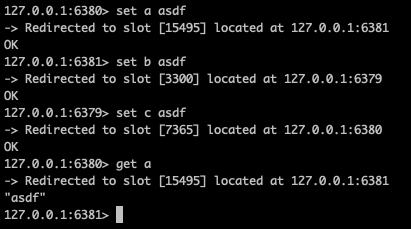

# 레디스

Redis는 대표적인 인 메모리 데이터 스토어로 매우 빠른 데이터 액세스 시간을 보장합니다. key-value 형식으로 데이터를 저장하며 다른 key-value 스토어와는 다르게, 사용할 수 있는 데이터 구조가 많습니다. (Strings, Lists, Sets, Sorted Sets, Hashes, ...) 또한 레디스는 Pub/Sub 표준을 지원하여 이벤트 기반 실시간 작업을 고성능으로 처리할 수 있습니다.

메모리상에서 동작하므로 기본적으로 휘발성이지만, 영속성을 위한 RDB 또는 AOF 등과 같은 영구 저장 기능을 지원하고 있습니다.

- `RDB`(Redis Database): 스냅샷을 바이너리파일(.rdb)로 저장
  - redis.conf의 `save` 파라미터, `BGSAVE`, `SAVE` 명령
- `AOF`(Append Only File): 입력/수정/삭제 명령마다 appendonly.aof 파일에 기록
  - redis.conf의 `appendonly` 파라미터

레디스는 여러 기능을 제공함과 동시에 구성과 제어가 어렵지 않아 많은 환경에서 사용되고 있습니다. 캐시 처리, 채팅 및 메시징, 세션 관리, 게임 리더보드 등의 사례에서 많이 사용되며, 레디스를 기본 데이터베이스로 사용하기도 합니다.

# Docker로 레디스 시작하기

도커를 활용해 레디스를 간단히 실행할 수 있습니다. `redis` 공식 이미지를 사용해 다음과 같이 실행할 수 있습니다. 이 포스트에서는 레디스 버전은 6.2를 사용합니다.

```bash
docker run -d -p 6379:6379 --name redis-test redis:6.2

# M1 MacOS
docker run -d -p 6379:6379 --name redis-test --platform=linux/x86_64 redis:6.2
```

`redis-cli` 를 실행하는 `docker exec` 명령으로 실행중인 레디스 런타임에 접근할 수 있습니다.

```docker
docker exec -it redis-test redis-cli
```



# 레디스 클러스터 모드

레디스는 클러스터 모드로 실행할 수 있습니다. 클러스터 모드는 여러 레디스 노드에 자동적으로 데이터가 분산되어 저장되고, 분산 저장된 데이터를 올바르게 불러올 수 있도록 하며, 특정 노드에 장애가 일어나더라도 클러스터가 올바르게 작업을 지속할 수 있도록 합니다.

레디스 클러스터 모드를 구성하기 위해서는 두 TCP 커넥션이 열려있어야 합니다. 레디스 인스턴스를 실행하는 데 사용되는 TCP 포트와 “cluster bus” 라고 불리는 두번째 포트가 필요합니다. cluster bus 포트는 일반적으로 기본 포트에 10000 이 더해진 포트를 사용하게 됩니다. (redis client 6379, cluster bus 16279) 이 cluster bus 포트는 노드 간 통신을 위한 채널이고, 여기서 작업 실패 감지, 설정 변경, 장애조치등을 위한 통신이 진행됩니다.

레디스 클러스터는 클러스터 모드가 활성화된 레디스 노드들이 실행된 상태에서 redis-cli를 통해 시작할 수 있습니다.

```bash
redis-cli —cluster create —cluster-yes [...host:port]
```

## Docker compose로 클러스터 구성하기

레디스 클러스터 모드는 레디스 설정 파일 `redis.conf` 에서 설정할 수 있습니다. 클러스터 환경을 구성하기 위해서는 다음과 같이 설정할 수 있습니다.

```
port 6379
cluster-enabled yes
cluster-config-file node.conf
cluster-node-timeout 5000
# AOF 를 통해 failover 된 레디스 노드 재 시작시 이전 데이터를 다시 로드해 올 수 있습니다.
appendonly yes
```

(레디스 설정에 대한 더 자세한 내용은 [레디스 설정 문서](https://redis.io/topics/config) 에서 더 확인할 수 있습니다.)

클러스터를 구성하기 위해서는 최소 3개 이상의 레디스 노드가 있어야 합니다. 따라서 최소 3개의 conf 파일을 구성해 주도록 합니다. 동일한 호스트의 동일한 포트에서는 실행될 수 없으므로 포트가 다른 세 파일이 구성되어야 합니다. 필자는 redis.conf에 6379, redis2.conf에 6380, redis3.conf에 6381 포트를 갖고 나머지 설정은 동일한 설정 파일을 각각 구성하였습니다.

도커의 다중 컨테이너 도구인 docker-compose 로, 앞서 작성한 설정파일을 로딩한 레디스 노드들을 구성하도록 합니다.

```docker
version: "3"
services:
  redis-cluster:
    platform: linux/x86_64 # m1 MacOS의 경우
    image: redis:6.2
    container_name: redis-test
    volumes: # 작성한 설정 파일을 볼륨을 통해 컨테이너에 공유
      - ./redis.conf:/usr/local/etc/redis/redis.conf
    command: redis-server /usr/local/etc/redis/redis.conf
    ports:
      - 6380:6380
      - 6381:6381
      - 6379:6379

  redis-node-1:
    network_mode: "service:redis-cluster"
    platform: linux/x86_64
    image: redis:6.2
    container_name: redis-test1
    volumes:
      - ./redis1.conf:/usr/local/etc/redis/redis.conf
    command: redis-server /usr/local/etc/redis/redis.conf

  redis-node-2:
    network_mode: "service:redis-cluster"
    platform: linux/x86_64
    image: redis:6.2
    container_name: redis-test2
    volumes:
      - ./redis2.conf:/usr/local/etc/redis/redis.conf
    command: redis-server /usr/local/etc/redis/redis.conf

  redis-cluster-entry:
    network_mode: "service:redis-cluster"
    platform: linux/x86_64
    image: redis:6.2
    container_name: redis-cluster-entry
    command: redis-cli --cluster create 127.0.0.1:6379 127.0.0.1:6380 127.0.0.1:6381 --cluster-yes
    depends_on:
      - redis-cluster
      - redis-node-1
      - redis-node-2
```

각 레디스 노드 컨테이너는 볼륨(`volumns` 필드)을 통해 구성한 레디스 환경설정 파일을 각 컨테이너로 공유합니다. 이후, `redis-server <설정파일위치>` 와 같이 실행 스크립트를 구성(`command` 필드)합니다.

작성한 docker-compose.yml 파일에서 먼저 눈 여겨 볼 점은 각 레디스 노드들이 하나의 네트워크 “service:redis-cluster”를 공유하고 있다는 점(`network_mode` 필드)입니다.

레디스 클러스터는 현재 네트워크 주소 변환(Network Address Transport, NAT)된 환경 또는 IP주소 / TCP 포트를 재맵핑하는 환경을 지원하지 않습니다.  
도커는 컨테이너 내부에서 실행되는 프로그램을 특정 외부 포트로 노출할 수 있는 “포트 매핑” 기술을 사용하고 있으며, 이는 여러 컨테이너가 동일한 포트를 가지는 상황을 해결하는 데에 유용하게 사용되고 있습니다.  
도커 상에서 실행하는 레디스 컨테이너들이 레디스 클러스터에 호환하도록 하기 위해서는 “host” 네트워크 모드를 사용하는 것을 필요로 합니다. host 네트워크모드는 포트 매핑을 통해 주소를 변환하지 않고, 컨테이너가 호스트 네트워크를 곧바로 사용하도록 합니다. ([참고링크](https://redis.io/docs/management/scaling/#create-a-redis-cluster:~:text=Redis%20Cluster%20and,for%20more%20information.))

그러나 우리는 host 모드를 사용하지 않고, 각 레디스 노드에 대한 포트가 한번에 매핑된 하나의 **동일한 네트워크를 각 노드가 공유**하도록 구성하는 방식으로 구성하였습니다. ([참고링크1](https://docs.docker.com/engine/reference/run/#network-container), [참고링크2](https://stackoverflow.com/questions/52688218/can-docker-compose-share-an-ip-between-services-with-discrete-ports))

redis-cluster-entry 서비스는 클러스터 모드를 활성화 하는 작업을 진행하는 컨테이너를 구성합니다. 다른 레디스 노드들과 동일하게 service:redis-cluster 네트워크상에서 동작하며, `redis-cli —-cluster create` 명령으로 클러스터를 시작하도록 합니다. 이 서비스는 세개의 레디스 노드 컨테이너가 모두 실행된 이후에 작업이 진행되어야 하므로, `depends_on` 필드에 각 의존 컨테이너를 명시하도록 합니다.

이제 마스터 노드가 3개인 레디스 클러스터 환경이 갖추어 졌습니다.

```bash
# CLI 접근시 -c 옵션을 통해 클러스터 지원을 활성화 하도록 합니다.
docker exec -it redis-test -c
# 올바르게 CLI에 접근되지 않는다면
docker exec -it redis-test redis-cli -c
```

위 명령어로 레디스 노드 컨테이너에 접속해 `CLUSTER INFO` 와 `CLUSTER NODES` 명령을 통해 클러스터 설정이 올바르게 되었는 지 확인해봅니다.



`SET`, `GET` 명령을 통해 데이터를 입력했을 때 다음과 같이 자동으로 분산 저장되고, 분산 저장된 데이터를 올바르게 불러오는 것을 확인할 수 있습니다.



## 참고문서

- https://redis.io/docs/management/scaling/#create-a-redis-cluster
- https://docs.docker.com/engine/reference/run/#network-container
- https://stackoverflow.com/questions/52688218/can-docker-compose-share-an-ip-between-services-with-discrete-ports
